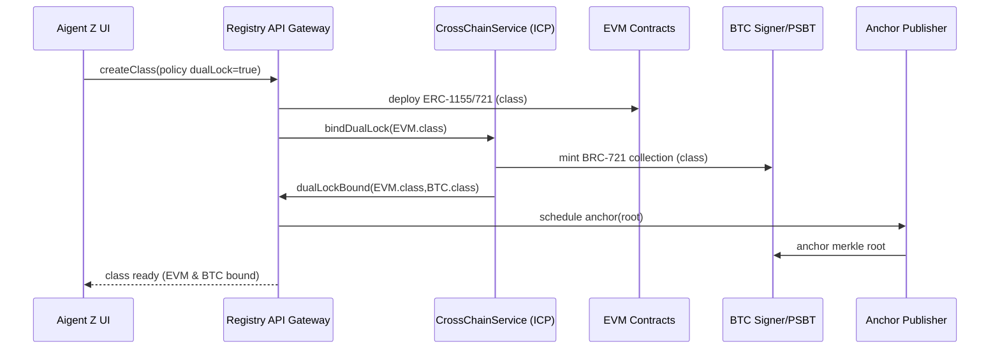
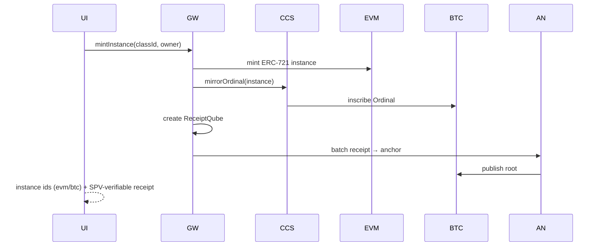
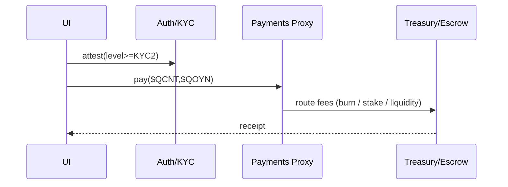

# iQube ICP/BTC Architecture — Program Convergence with Aigent Z Beta & 21 Sats

**Audience**: Protocol engineers, canister devs, solidity engineers, devops, PMs.  
**Purpose**: Define a production-tractable, BTC-anchored, ICP-centric, EVM-interoperable architecture for the iQube protocol; specify seams to integrate with **Aigent Z Beta** (orchestrator & registry) and align with **21 Sats** (consumer cryptomedia launch). Treat all three as coordinated work streams that converge into one system.

---

## 1) Goals & Non-Goals
**Goals**
1. BTC-anchored settlement of iQube state (Merkle-batched roots; selective proofs).  
2. Dual rails for NFTs & tokens: **EVM (ERC-20/721/1155)** and **BTC (Ordinals/BRC-721/Runes)**.  
3. Clean **interoperability** seam (EVM↔EVM via LayerZero; BTC legs via ICP BTC signer; later **TachiAdapter**).  
4. Payments in **$QOYN** and **$QCNT**; staking & treasury controls; custodian-backed QCNT attestations.  
5. **Sovereign memory** & privacy via metaQube / blakQube / tokenQube with policy gates & audit.  
6. Identity & compliance via **DIDQube + FIO**, **KYC/AML attestation adapters**.  
7. Developer ergonomics: simple APIs; deterministic flows; observable, testable, auditable.

**Non-Goals (now)**
- Full L2 execution on BTC; optimistic/ZK rollup to L1 (kept as R&D).  
- Hard dependency on Tachi before public/testnet stability; we keep the seam ready.

---

## 2) System Overview (Layered)

```mermaid
flowchart TB
  subgraph Client Apps
    A1[Aigent Z Beta UI]
    A2[21 Sats Site & Marketplace]
    A3[3rd-party dApps / Wallets]
  end

  subgraph Aigent Z Services (Next.js/Edge)
    Z1[Registry API Gateway]
    Z2[Auth & KYC Gateway]
    Z3[Payments Proxy]
  end

  subgraph iQube Protocol Services (ICP)
    C1[CrossChainService
       (LayerZero DVN on ICP)]
    C2[EVM RPC Canister]
    C3[BTC Signer (tECDSA) & PSBT]
    C4[Proof-of-State Anchor Publisher]
    C5[IdentityRegistry (DIDQube/FIO)]
    C6[StorageFabric (meta/blak/tokenQube)]
    C7[Risk & Policy Engine]
  end

  subgraph EVM Chains
    E1[ERC-20/721/1155 Contracts]
    E2[LayerZero Endpoints (OFT/ONFT/OSFT)]
    E3[Treasury & Escrow]
  end

  subgraph Bitcoin
    B1[Ordinals / BRC-721]
    B2[Runes Policies]
    B3[BTC L1 Anchors]
  end

  A1 --> Z1
  A2 --> Z1
  A3 --> Z1
  Z1 --> C6
  Z1 --> C5
  Z1 --> C1
  Z1 --> C2
  Z1 --> C3
  Z1 --> C4
  Z2 --> C5
  Z3 --> E3

  C1 <--> E2
  C2 <--> E1
  C3 --> B1
  C3 --> B2
  C4 --> B3

  C7 -.policy.-> C6
  C7 -.policy.-> C1
  C7 -.policy.-> E3
```

**Key idea**: All cross-chain complexity lives behind **iQube Protocol (ICP)** seams. Aigent Z consumes stable, product-level APIs and focuses on UX/ops. 21 Sats uses the same APIs (via Aigent Z Gateway) to ship the first consumer launch.

---

## 3) Core Components & Responsibilities

### 3.1 CrossChainService (ICP)
- **Role**: Single façade for cross-chain messaging & bridging.  
- **Implementations**:  
  - **LayerZero DVN (ICP)** for EVM↔EVM messages;  
  - **BTC Adapter** (via tECDSA, PSBT) for BTC legs (mint/burn, lock/release, anchoring);  
  - **TachiAdapter** (future): slots into same interface.
- **Reliability**: DVN quorum rules, replay protection, circuit breakers.

### 3.2 EVM RPC Canister (ICP)
- Gateway for EVM JSON-RPC (query & submit signed tx).  
- Prefer `ic-alloy` for signing; use replicated EVM-RPC for reads that must be consensus-safe.

### 3.3 BTC Signer & PSBT (ICP)
- Holds chain-key **tECDSA** identity; builds PSBTs; broadcasts via reliable peers; RBF/reorg policies.  
- Exposes: `newOrdinalInscription`, `mintBRC721`, `mintRunes`, `anchorRoot`.

### 3.4 Proof-of-State Anchor Publisher (ICP)
- Batches iQube receipts (Merkle); publishes **state roots to BTC L1** on cadence; emits SPV-verifiable proofs.

### 3.5 IdentityRegistry (ICP)
- **DIDQube** (rotating DID, network anonymity) and **FIO handle** binding; stores **attestations**, not PII.  
- KYC/AML providers behind a pluggable adapter (`providerId`, `level`, `expiry`).

### 3.6 StorageFabric (ICP)
- metaQube (public JSON), blakQube (encrypted payloads, S3/IPFS/TEE), tokenQube (keys & policy).  
- Envelope encryption; role-based grants with audit trails.

### 3.7 Risk & Policy Engine (ICP)
- Pre-crime checks (limits, sanctions, geofences).  
- Escrow invariants; slashing/penalties; emergency pause.

### 3.8 EVM Contracts
- $QOYN (emissions 21M/21y; controller), $QCNT (custodian claim token), staking, treasury, fee router.  
- iQube **classes** (ERC-721/1155) and **instances** (ERC-721/1155), optionally **OSFT/ONFT**.

### 3.9 Bitcoin Artifacts
- **Ordinals** (instances), **BRC-721** (collections/classes), **Runes** ($QOYN/$QCNT mirrors) with indexers.  
- **Anchors**: OP_RETURN or equivalent commitment of Merkle root.

---

## 4) Data & Schema Contracts

### 4.1 iQube Class (Template)
```json
{
  "classId": "iqc:evm:1|btc:insc:...",
  "creator": "0x...",
  "policy": {
    "dualLock": true,
    "royalties": {"bps": 500, "receiver": "0x..."},
    "privacy": {"networkAnonymous": true, "consent": ["no-train"]},
    "bridge": {"enabled": true, "routes": ["evm-evm", "evm-btc"]}
  },
  "metaQubeHash": "0x...",
  "runesPolicyId": "(optional)",
  "osftClassId": "(optional)"
}
```

### 4.2 iQube Instance (Object)
```json
{
  "instanceId": "iqo:evm:721#123|btc:ord:...",
  "classId": "iqc:...",
  "owner": "0x... or bc1...",
  "tokenQubeRef": "tq:...",
  "blakQubeRefs": ["bq://s3/...", "ipfs://..."]
}
```

### 4.3 ReceiptQube
```json
{
  "receiptId": "rq:...",
  "events": [{"type": "MINT", "tx": "0x...", "chain": "evm"}, ...],
  "merkleLeaf": "0x...",
  "anchor": {"txid": "...", "block": 123456, "proof": "spv..."}
}
```

---

## 5) Protocol Flows (Representative)

### 5.1 Dual-Lock Mint (EVM class ↔ BTC class)


### 5.2 Instance Mint (Ordinals + ERC-721) with Proof-of-State


### 5.3 Payments in $QOYN / $QCNT with KYC Gate


---

## 6) Integration with Aigent Z Beta (Converging Projects)
**Program approach**: Two projects in one program; **Aigent Z Beta** focuses on orchestration & UX; **iQube ICP/BTC** focuses on protocol & bridges. They meet at stable APIs.

### 6.1 API Surfaces Consumed by Aigent Z
- **MintController API**: `createClass`, `mintInstance`, `dualLockMint`, `burn|lock|release`, `setPolicy`, `royaltyConfig`.
- **CrossChainService API**: `submit(payload)→msgId`, `verify(proof)`, `finalize(msgId)`; routes to LayerZero DVN or BTC adapter.
- **ProofOfState API**: `issueReceipt(tx)`, `batch()`, `anchor()`, `verify(spv)`.
- **PaymentsGateway API**: `pay(asset,$QOYN|$QCNT)`, `stake`, `redeem`, `feeSplit`.
- **IdentityRegistry API**: `linkFIO`, `attestKYC(provider,level)`, `check(addr)`.
- **StorageFabric API**: `put(meta)`, `store(blak)`, `grant(tokenQube)`, `audit(qid)`.

### 6.2 Aigent Z Beta UI/UX Evolution
- **Registry**: add BTC readiness badges (Dual‑Lock, Ordinals present, Anchored).  
- **Creation Flow**: add toggle for **Dual‑Lock** and **Anonymous Mode**.  
- **Receipts**: show anchored status (SPV depth); download proof.  
- **Payments**: enable $QOYN/$QCNT at checkout; KYC gate where policy requires.  
- **Operator Pages**: anchors cadence, reserves attestations, DVN health.

### 6.3 Deployment Pipelines
- Separate envs (`dev/stage/prod`) for **Aigent Z** and **iQube ICP/BTC**; tagged releases; blue‑green upgrades on canisters; contract migrations with data snapshots.

---

## 7) Alignment with 21 Sats (Consumer Launch)
**Role**: 21 Sats is the first **cryptomedia** product using the **iQube Registry as distributed DB** and **Aigent Z** for agent orchestration.

**What 21 Sats requires (mapped)**
- Sharded SatoshiKNYT classes (**ERC‑1155** + **BRC‑721** collection) and object instances (**ERC‑721/Ordinals**).  
- Sales via **$QCNT** (stable claims) and **$QOYN**; referral rewards; royalties.  
- Public proofs: **anchored receipts** and class/instance dual‑lock visibility.  
- Token‑gated content: tokenQube‑gated blakQube payloads; creator dashboards.

**Launch Path**
- Phase 1 (MVP): EVM classes/instances; payments in $QOYN/$QCNT; LayerZero EVM↔EVM; receipt anchors to BTC on cadence.  
- Phase 2 (V1): BTC dual‑lock mints (Ordinals/BRC‑721), Rune mirrors for $QOYN/$QCNT, PSBT escrow for settlements.

---

## 8) Security, Compliance, and Risk
- **Bridging & Messaging**: DVN quorum; re‑try with idempotence; replay guards; circuit breakers; chaos tests.  
- **BTC Anchors**: RBF policy; fee estimator; reorg detection & re‑anchor.  
- **QCNT Custody**: multi‑venue attestations; pause/rebalance; PoR dashboards.  
- **KYC/AML**: provider‑agnostic; attestations‑only; expiry & level; geo‑fencing.  
- **Privacy**: network anonymity (rotating DID); consent flags (e.g., "no‑train"); audit trails.

---

## 9) Program Milestones & Convergence
- **M1 (Weeks 1–4)**: Repos/CI; canister skeletons; LayerZero DVN on ICP; EVM RPC wired; BTC tECDSA/PSBT PoC.  
- **M2 (Weeks 5–10)**: EVM mints (classes/instances); OFT/ONFT; $QOYN/$QCNT payments; receipts; anchors v0; Aigent Z UI flags.  
- **M3 (Weeks 11–16)**: BTC dual‑lock mints; Rune policy draft; escrow; KYC policy matrix; operator dashboards; 21 Sats SKU wiring.  
- **M4 (Post‑16w)**: TachiAdapter PoC; BTC rollup research.

**Program DoD**: Aigent Z Beta and iQube ICP/BTC expose stable APIs; 21 Sats ships on top with BTC‑anchored receipts, dual‑lock mints, and $QOYN/$QCNT payments.

---

## 10) Appendix — Interface Sketches

### 10.1 CrossChainService (Candid-like)
```txt
service : {
  submit : (payload: vec nat8) -> (msg_id: text);
  finalize : (msg_id: text) -> (result: variant {Ok; Err: text});
  verify : (proof: vec nat8) -> (bool);
}
```

### 10.2 MintController
```txt
createClass(policy: Policy) -> ClassId
mintInstance(classId: ClassId, to: Address) -> InstanceId
dualLockMint(classId: ClassId) -> (EvmClassId, BtcClassId)
lock(tokenId) / release(tokenId, proof)
```

### 10.3 ProofOfState
```txt
issueReceipt(tx: TxRef) -> ReceiptId
batch() -> RootId
anchor() -> BtcTxid
verify(spv: bytes) -> bool
```

### 10.4 PaymentsGateway
```txt
pay(asset: {QOYN|QCNT}, amount: uint256) -> PaymentReceipt
stake(amount: uint256) -> StakeId
redeemQCNT(amount: uint256) -> RedeemReceipt
```

### 10.5 IdentityRegistry
```txt
linkFIO(handle: text) -> FioId
attestKYC(provider: text, level: nat8, expiry: nat64) -> AttestationId
check(addr: Address) -> {level: nat8, valid: bool}
```

— End —
