# iQube ICP/BTC — Protocol Diagrams (v1)

**Purpose**: Protocol-grade visuals for engineers, auditors, and operators. Mirrors the style/coverage used for Aigent Z Beta. Copy-pasteable **Mermaid** so we can render in docs sites and IDE previews.

---

## 1) Layered Architecture & Trust Boundaries

```mermaid
flowchart TB
  classDef tb fill:#fff,stroke:#333,stroke-width:2px,stroke-dasharray: 5 5
  classDef svc fill:#eef,stroke:#336
  classDef chain fill:#efe,stroke:#363
  classDef infra fill:#fee,stroke:#633

  subgraph CLIENTS[Client Applications]
    A1[Aigent Z Beta UI]
    A2[21 Sats Site & Marketplace]
    A3[3rd-party Wallets/dApps]
  end

  subgraph EDGE[API Edge / Gateways]
    Z1[Registry API Gateway]
    Z2[Auth + KYC Gateway]
    Z3[Payments Proxy]
  end
  class EDGE tb

  subgraph ICP[iQube Protocol — ICP Canisters]
    C1[CrossChainService\n(LayerZero DVN on ICP)]:::svc
    C2[EVM RPC Canister]:::svc
    C3[BTC Signer (tECDSA) + PSBT]:::svc
    C4[Proof-of-State Anchor Publisher]:::svc
    C5[IdentityRegistry\n(DIDQube + FIO)]:::svc
    C6[StorageFabric\n(metaQube / blakQube / tokenQube)]:::svc
    C7[Risk & Policy Engine]:::svc
  end
  class ICP tb

  subgraph EVM[EVM Chains]
    E1[ERC-20/721/1155 Contracts]:::chain
    E2[LayerZero Endpoints (OFT/ONFT/OSFT)]:::chain
    E3[Treasury, Staking, Escrow]:::chain
  end
  class EVM tb

  subgraph BTC[Bitcoin]
    B1[Ordinals / BRC-721]:::chain
    B2[Runes Policies]:::chain
    B3[Anchors (OP_RETURN)]:::chain
  end
  class BTC tb

  A1-->Z1
  A2-->Z1
  A3-->Z1
  Z1-->C6
  Z1-->C5
  Z1-->C1
  Z1-->C2
  Z1-->C3
  Z1-->C4
  Z2-->C5
  Z3-->E3
  C1<-->E2
  C2<-->E1
  C3-->B1
  C3-->B2
  C4-->B3
  C7-.policy.->C6
  C7-.policy.->C1
  C7-.policy.->E3
```

---

## 2) C4-Style Container View

```mermaid
flowchart LR
  user[Users/Creators]
  admin[Operators]

  ui[Web UI (Aigent Z Beta)]
  apigw[API Gateway]
  auth[Auth/KYC Gateway]

  can_xcs[CrossChainService]
  can_evmm[EVM RPC]
  can_btc[BTC Signer/PSBT]
  can_pos[Proof-of-State]
  can_id[IdentityRegistry]
  can_store[StorageFabric]
  can_risk[Risk & Policy]

  evm[EVM Contracts]
  lz[LayerZero Endpoints]
  btc[Bitcoin Network]

  user-->ui
  admin-->ui
  ui-->apigw
  ui-->auth
  apigw-->can_store
  apigw-->can_id
  apigw-->can_xcs
  apigw-->can_evmm
  apigw-->can_btc
  apigw-->can_pos
  can_xcs<-->lz
  can_evmm<-->evm
  can_btc-->btc
  can_pos-->btc
```

---

## 3) Plugin Architecture — CrossChainService

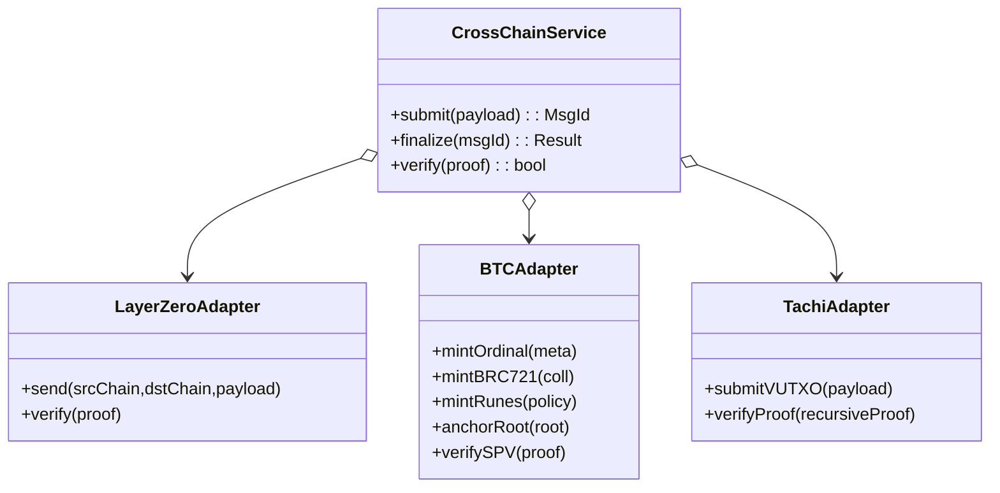

---

## 4) Data Model (ERD)

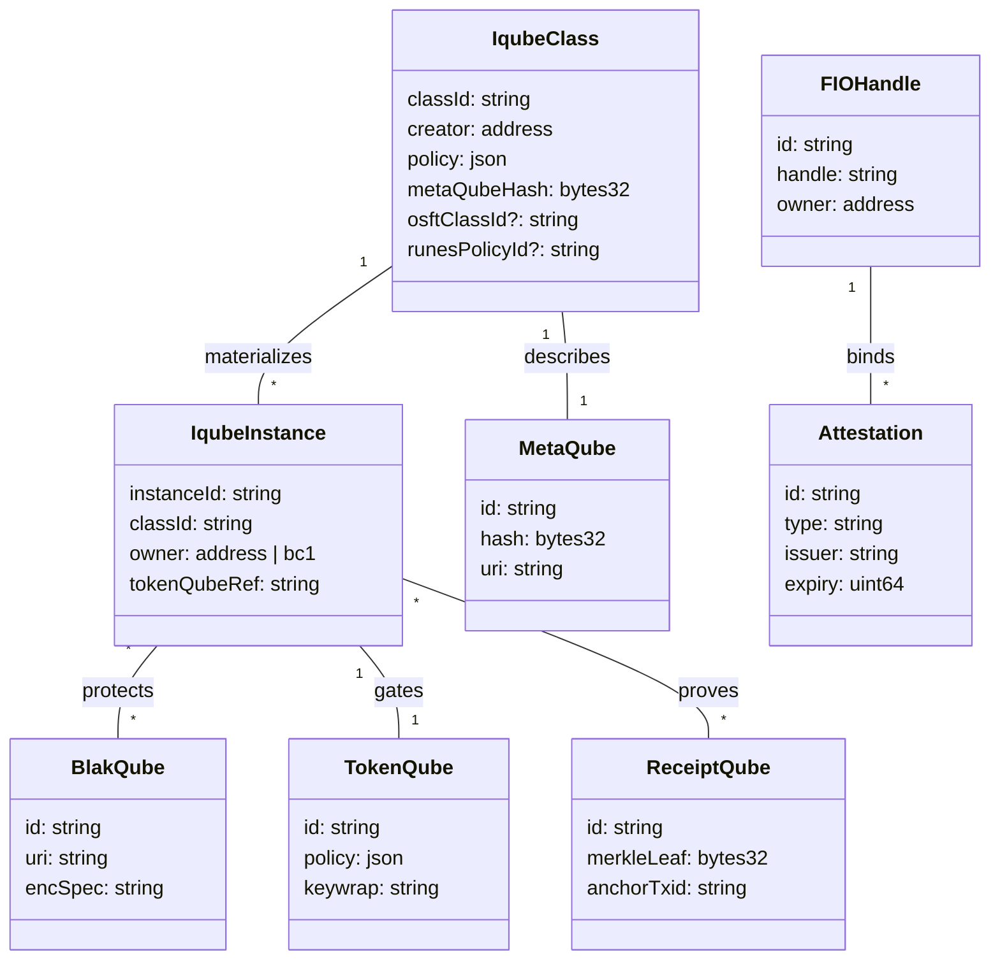

---

## 5) Sequence — Dual-Lock Class Mint (EVM ↔ BTC)

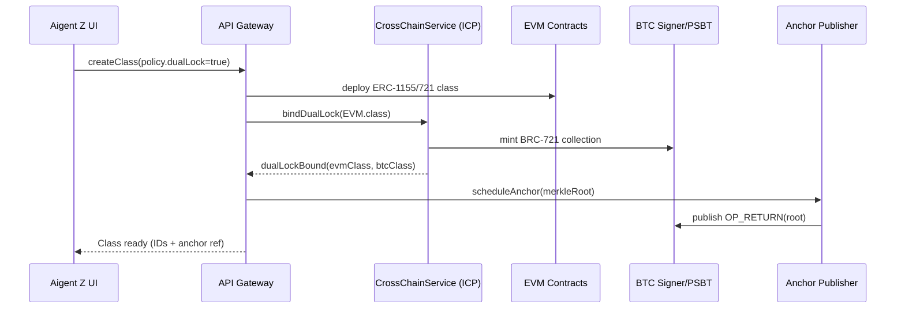

---

## 6) Sequence — Instance Mint + BTC Mirror + Proof-of-State

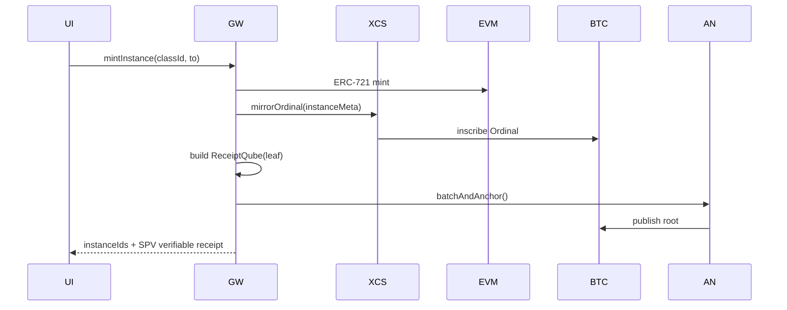

---

## 7) Sequence — EVM↔EVM via LayerZero DVN (on ICP)

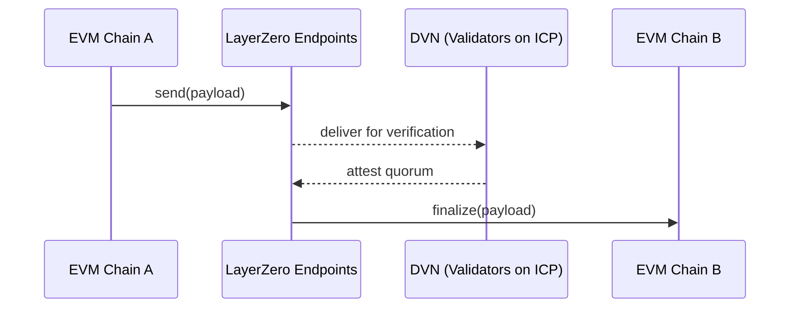

---

## 8) Sequence — BTC PSBT Escrow (Time-lock + Oracle)

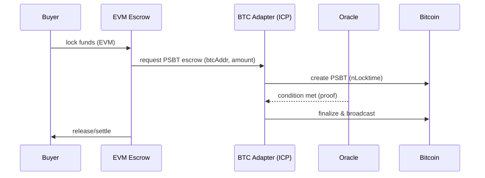

---

## 9) Sequence — Payments with $QOYN/$QCNT + KYC Gate

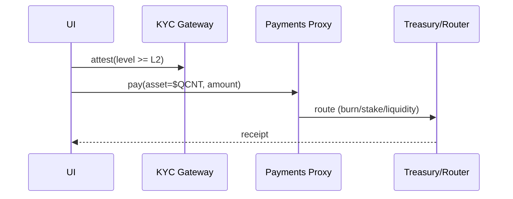

---

## 10) Sequence — Proof-of-State Anchor Lifecycle

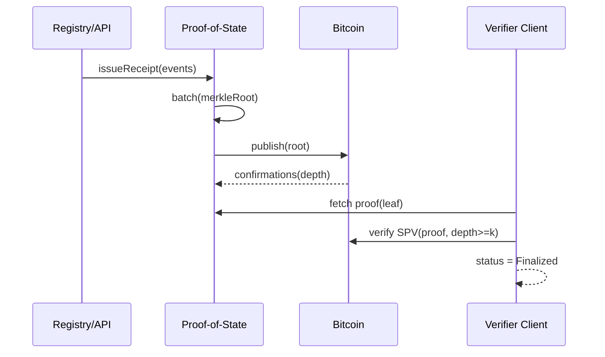

---

## 11) State Machine — Dual-Lock Token

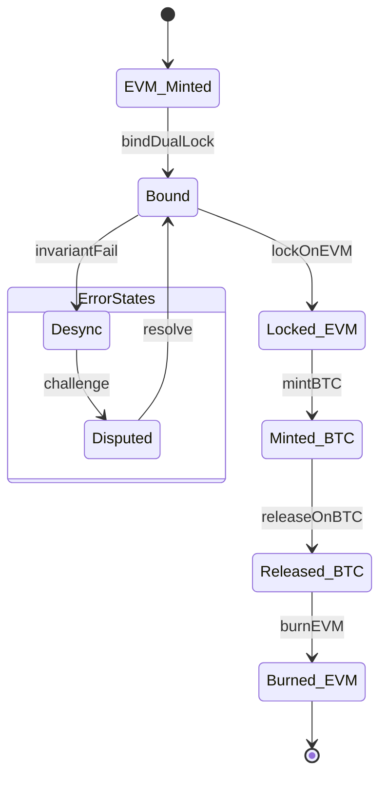

---

## 12) State Machine — Anchor Lifecycle

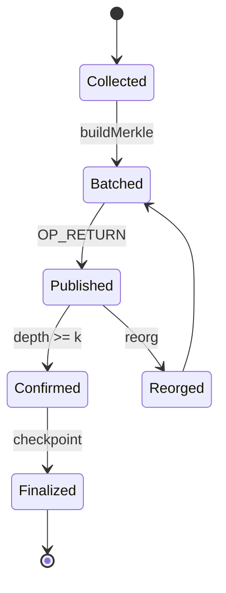

---

## 13) Deployment Diagram (Envs & Observability)

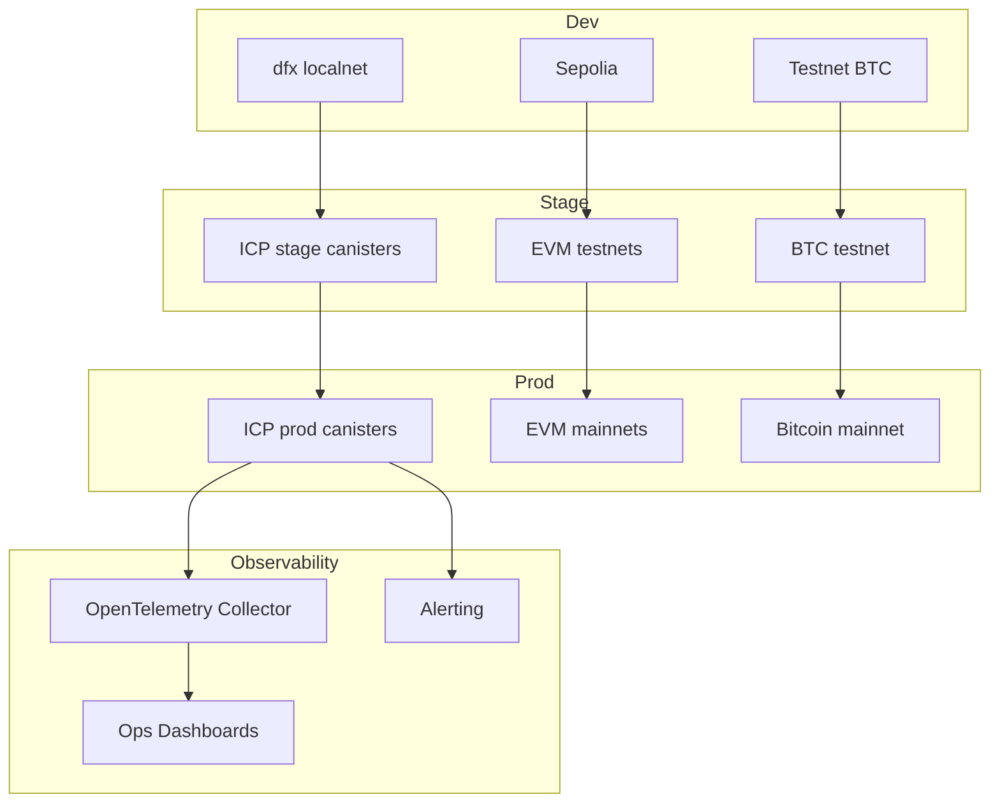

---

## 14) Threat Model (STRIDE) — Summary Table

| Threat             | Surface                   | Control                                               |
| ------------------ | ------------------------- | ----------------------------------------------------- |
| Spoofing           | KYC/Identity, Bridge Msgs | Attestations w/ expiry; DVN quorum; sig verification  |
| Tampering          | Merkle roots, receipts    | SPV proofs; immutable logs; audits                    |
| Repudiation        | Payments, mints           | ReceiptQube + anchors; non-repudiation via signatures |
| Info Disclosure    | blakQube payloads         | Envelope encryption; tokenQube gating; RLS            |
| DoS                | Bridge/Anchors            | Rate limits; circuit breakers; backpressure           |
| Elev. of Privilege | Admin ops                 | Multi-sig; role-based access; approvals               |

---

## 15) TachiAdapter — Integration Path (Future)

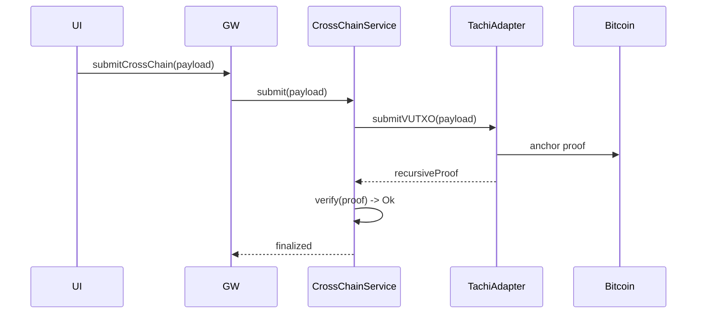

---

**Notes**

- All diagrams are intentionally **interface-driven** to keep the program modular and to de-risk future swaps (e.g., TachiAdapter).
- We’ll export SVG/PNG variants for decks once the team confirms these are the right set; source-of-truth remains Mermaid in repo `/docs/architecture/`.
