# iQube ICP/BTC — Protocol Diagrams (v1)

**Purpose**: Protocol-grade visuals for engineers, auditors, and operators. Mirrors the style/coverage used for Aigent Z Beta. Copy-pasteable **Mermaid** so we can render in docs sites and IDE previews.

---

## 1) Layered Architecture & Trust Boundaries

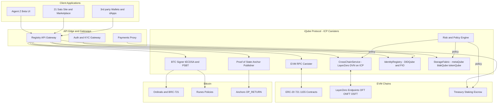
```mermaid
flowchart TB

  subgraph CLIENTS[Client Applications]
    A1[Aigent Z Beta UI]
    A2[21 Sats Site and Marketplace]
    A3[3rd party Wallets and dApps]
  end

  subgraph EDGE[API Edge and Gateways]
    Z1[Registry API Gateway]
    Z2[Auth and KYC Gateway]
    Z3[Payments Proxy]
  end

  subgraph ICP[iQube Protocol - ICP Canisters]
    C1[CrossChainService - LayerZero DVN on ICP]
    C2[EVM RPC Canister]
    C3[BTC Signer tECDSA and PSBT]
    C4[Proof of State Anchor Publisher]
    C5[IdentityRegistry - DIDQube and FIO]
    C6[StorageFabric - metaQube blakQube tokenQube]
    C7[Risk and Policy Engine]
  end

  subgraph EVM[EVM Chains]
    E1[ERC-20 721 1155 Contracts]
    E2[LayerZero Endpoints OFT ONFT OSFT]
    E3[Treasury Staking Escrow]
  end

  subgraph BTC[Bitcoin]
    B1[Ordinals and BRC-721]
    B2[Runes Policies]
    B3[Anchors OP_RETURN]
  end

  A1-->Z1
  A2-->Z1
  A3-->Z1
  Z1-->C6
  Z1-->C5
  Z1-->C1
  Z1-->C2
  Z1-->C3
  Z1-->C4
  Z2-->C5
  Z3-->E3
  C1<-->E2
  C2<-->E1
  C3-->B1
  C3-->B2
  C4-->B3
  C7-- policy --> C6
  C7-- policy --> C1
  C7-- policy --> E3
```

---

## 2) C4 Style Container View

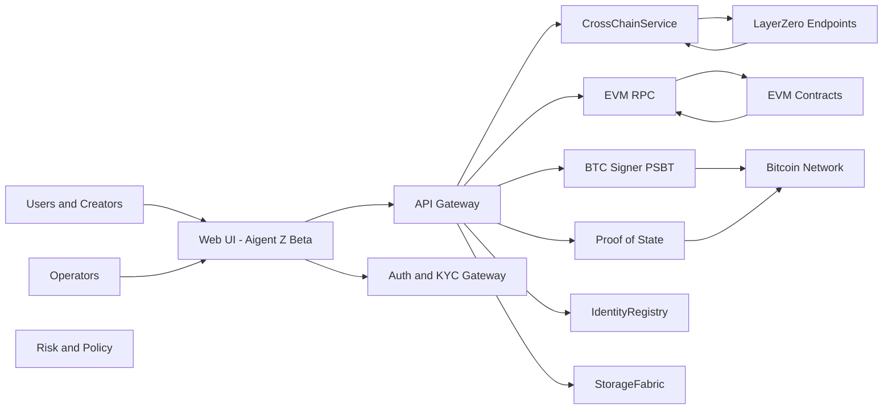
```mermaid
flowchart LR
  user[Users and Creators]
  admin[Operators]

  ui[Web UI - Aigent Z Beta]
  apigw[API Gateway]
  auth[Auth and KYC Gateway]

  can_xcs[CrossChainService]
  can_evmm[EVM RPC]
  can_btc[BTC Signer PSBT]
  can_pos[Proof of State]
  can_id[IdentityRegistry]
  can_store[StorageFabric]
  can_risk[Risk and Policy]

  evm[EVM Contracts]
  lz[LayerZero Endpoints]
  btc[Bitcoin Network]

  user-->ui
  admin-->ui
  ui-->apigw
  ui-->auth
  apigw-->can_store
  apigw-->can_id
  apigw-->can_xcs
  apigw-->can_evmm
  apigw-->can_btc
  apigw-->can_pos
  can_xcs-->lz
  lz-->can_xcs
  can_evmm-->evm
  evm-->can_evmm
  can_btc-->btc
  can_pos-->btc
```

---

## 3) Hybrid DVN Architecture - CrossChainService

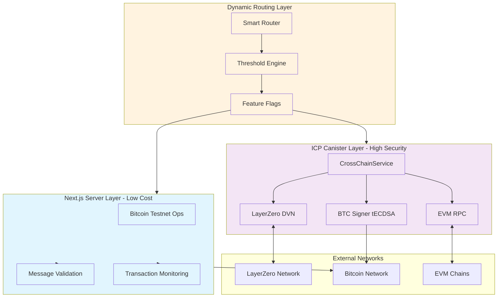
```mermaid
flowchart TB
  subgraph ROUTING[Dynamic Routing Layer]
    ROUTER[Smart Router]
    THRESH[Threshold Engine]
    FLAGS[Feature Flags]
  end

  subgraph SERVER[Next.js Server Layer - Low Cost]
    BTC_SERVER[Bitcoin Testnet Ops]
    VALIDATION[Message Validation]
    MONITORING[Transaction Monitoring]
  end

  subgraph CANISTER[ICP Canister Layer - High Security]
    XCS[CrossChainService]
    DVN[LayerZero DVN]
    BTC_SIGNER[BTC Signer tECDSA]
    EVM_RPC[EVM RPC]
  end

  subgraph EXTERNAL[External Networks]
    LZ_NET[LayerZero Network]
    BTC_NET[Bitcoin Network]
    EVM_NET[EVM Chains]
  end

  ROUTER --> THRESH
  THRESH --> FLAGS
  FLAGS --> SERVER
  FLAGS --> CANISTER
  
  SERVER --> BTC_NET
  SERVER --> VALIDATION
  SERVER --> MONITORING
  
  XCS --> DVN
  XCS --> BTC_SIGNER
  XCS --> EVM_RPC
  
  DVN <--> LZ_NET
  BTC_SIGNER --> BTC_NET
  EVM_RPC <--> EVM_NET

  classDef serverLayer fill:#e1f5fe
  classDef canisterLayer fill:#f3e5f5
  classDef routingLayer fill:#fff3e0
  
  class SERVER,BTC_SERVER,VALIDATION,MONITORING serverLayer
  class CANISTER,XCS,DVN,BTC_SIGNER,EVM_RPC canisterLayer
  class ROUTING,ROUTER,THRESH,FLAGS routingLayer
```

### Hybrid DVN Routing Decision Flow

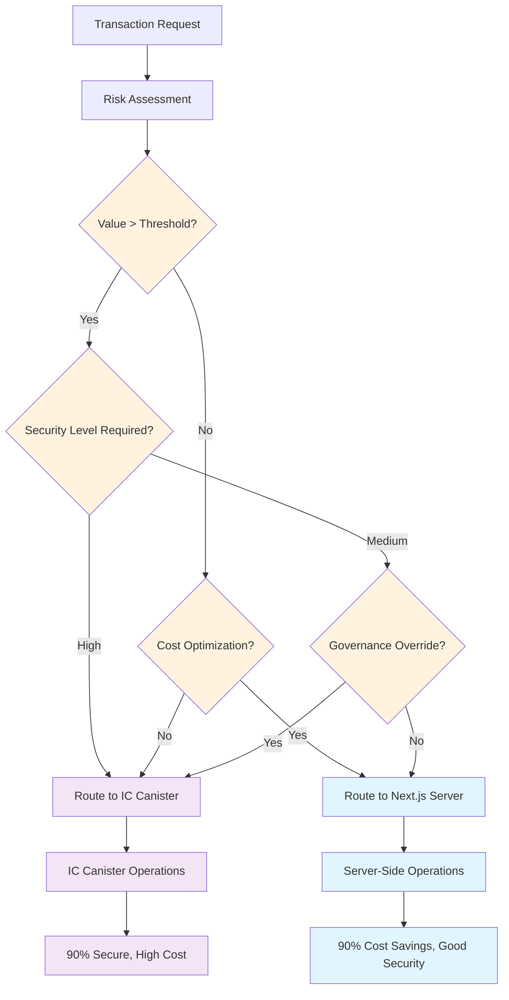
```mermaid
flowchart TD
  START[Transaction Request] --> ASSESS[Risk Assessment]
  ASSESS --> VALUE{Value > Threshold?}
  VALUE -->|Yes| SECURITY{Security Level Required?}
  VALUE -->|No| COST{Cost Optimization?}
  
  SECURITY -->|High| CANISTER[Route to IC Canister]
  SECURITY -->|Medium| GOVERNANCE{Governance Override?}
  
  COST -->|Yes| SERVER[Route to Next.js Server]
  COST -->|No| CANISTER
  
  GOVERNANCE -->|Yes| CANISTER
  GOVERNANCE -->|No| SERVER
  
  CANISTER --> IC_OPS[IC Canister Operations]
  SERVER --> SERVER_OPS[Server-Side Operations]
  
  IC_OPS --> RESULT[90% Secure, High Cost]
  SERVER_OPS --> RESULT2[90% Cost Savings, Good Security]
  
  classDef decision fill:#fff3e0
  classDef canisterPath fill:#f3e5f5
  classDef serverPath fill:#e1f5fe
  
  class VALUE,SECURITY,COST,GOVERNANCE decision
  class CANISTER,IC_OPS,RESULT canisterPath
  class SERVER,SERVER_OPS,RESULT2 serverPath
```

---

## 4) Data Model (ERD)

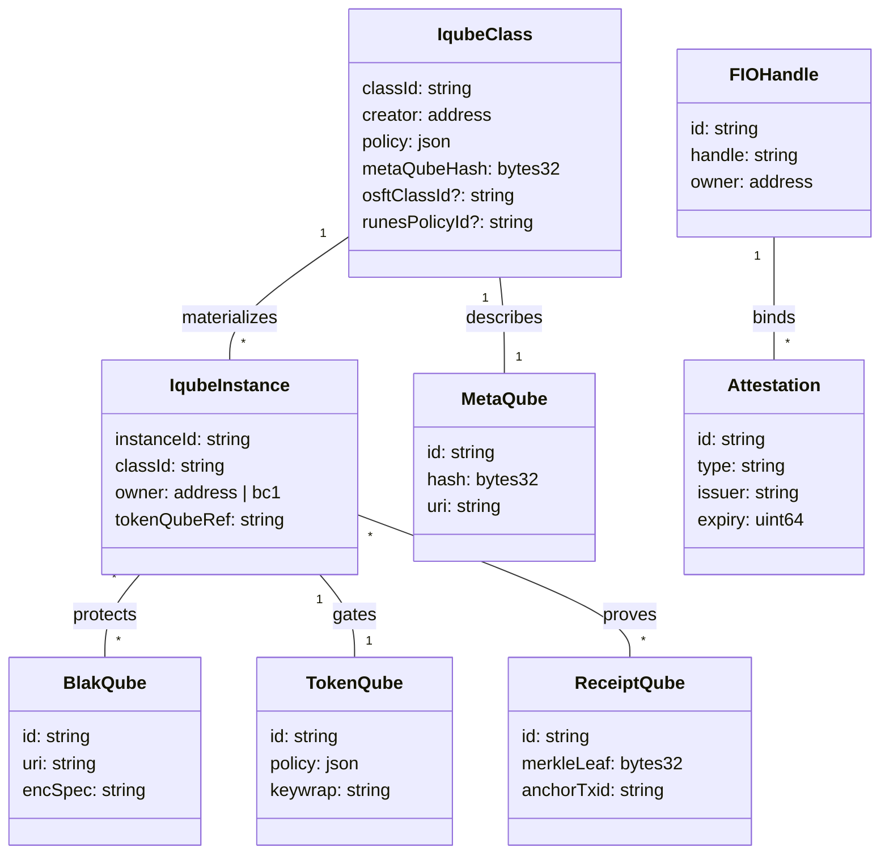
```mermaid
classDiagram
  class IqubeClass {
    classId: string
    creator: address
    policy: json
    metaQubeHash: bytes32
    osftClassId?: string
    runesPolicyId?: string
  }
  class IqubeInstance {
    instanceId: string
    classId: string
    owner: address | bc1
    tokenQubeRef: string
  }
  class MetaQube {
    id: string
    hash: bytes32
    uri: string
  }
  class BlakQube {
    id: string
    uri: string
    encSpec: string
  }
  class TokenQube {
    id: string
    policy: json
    keywrap: string
  }
  class ReceiptQube {
    id: string
    merkleLeaf: bytes32
    anchorTxid: string
  }
  class Attestation {
    id: string
    type: string
    issuer: string
    expiry: uint64
  }
  class FIOHandle {
    id: string
    handle: string
    owner: address
  }

  IqubeClass "1" -- "*" IqubeInstance: materializes
  IqubeClass "1" -- "1" MetaQube: describes
  IqubeInstance "*" -- "*" BlakQube: protects
  IqubeInstance "1" -- "1" TokenQube: gates
  IqubeInstance "*" -- "*" ReceiptQube: proves
  FIOHandle "1" -- "*" Attestation: binds
```

---

## 5) Sequence — Dual-Lock Class Mint (EVM ↔ BTC)

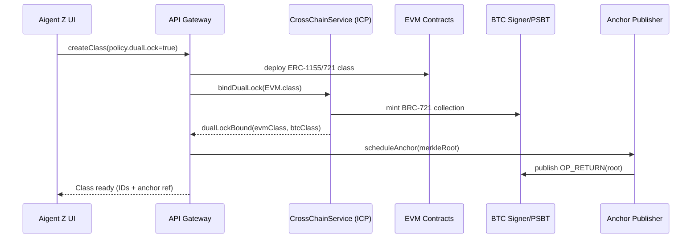
```mermaid
sequenceDiagram
  participant UI as Aigent Z UI
  participant GW as API Gateway
  participant XCS as CrossChainService (ICP)
  participant EVM as EVM Contracts
  participant BTC as BTC Signer/PSBT
  participant AN as Anchor Publisher

  UI->>GW: createClass(policy.dualLock=true)
  GW->>EVM: deploy ERC-1155/721 class
  GW->>XCS: bindDualLock(EVM.class)
  XCS->>BTC: mint BRC-721 collection
  XCS-->>GW: dualLockBound(evmClass, btcClass)
  GW->>AN: scheduleAnchor(merkleRoot)
  AN->>BTC: publish OP_RETURN(root)
  GW-->>UI: Class ready (IDs + anchor ref)
```

---

## 6) Sequence — Instance Mint + BTC Mirror + Proof-of-State

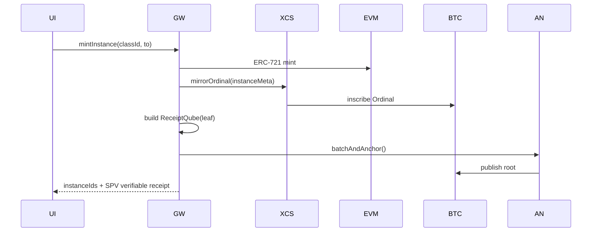
```mermaid
sequenceDiagram
  participant UI
  participant GW
  participant XCS
  participant EVM
  participant BTC
  participant AN

  UI->>GW: mintInstance(classId, to)
  GW->>EVM: ERC-721 mint
  GW->>XCS: mirrorOrdinal(instanceMeta)
  XCS->>BTC: inscribe Ordinal
  GW->>GW: build ReceiptQube(leaf)
  GW->>AN: batchAndAnchor()
  AN->>BTC: publish root
  GW-->>UI: instanceIds + SPV verifiable receipt
```

---

## 7) Sequence — Hybrid DVN Operation Flow

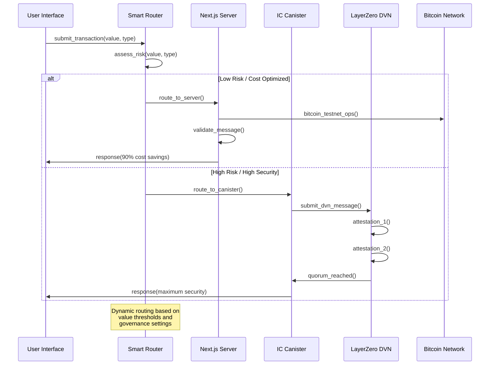
```mermaid
sequenceDiagram
  participant UI as User Interface
  participant ROUTER as Smart Router
  participant SERVER as Next.js Server
  participant CANISTER as IC Canister
  participant DVN as LayerZero DVN
  participant BTC as Bitcoin Network

  UI->>ROUTER: submit_transaction(value, type)
  ROUTER->>ROUTER: assess_risk(value, type)
  
  alt Low Risk / Cost Optimized
    ROUTER->>SERVER: route_to_server()
    SERVER->>BTC: bitcoin_testnet_ops()
    SERVER->>SERVER: validate_message()
    SERVER->>UI: response(90% cost savings)
  else High Risk / High Security
    ROUTER->>CANISTER: route_to_canister()
    CANISTER->>DVN: submit_dvn_message()
    DVN->>DVN: attestation_1()
    DVN->>DVN: attestation_2()
    DVN->>CANISTER: quorum_reached()
    CANISTER->>UI: response(maximum security)
  end
  
  Note over ROUTER: Dynamic routing based on<br/>value thresholds and<br/>governance settings
```

## 8) Sequence — EVM↔EVM via LayerZero DVN (on ICP)

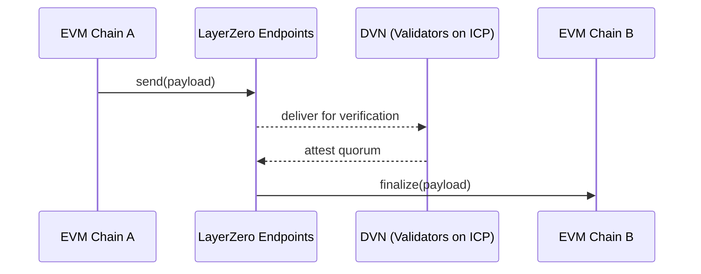
```mermaid
sequenceDiagram
  participant SRC as EVM Chain A
  participant LZ as LayerZero Endpoints
  participant DVN as DVN (Validators on ICP)
  participant DST as EVM Chain B

  SRC->>LZ: send(payload)
  LZ-->>DVN: deliver for verification
  DVN-->>LZ: attest quorum
  LZ->>DST: finalize(payload)
```

---

## 8) Sequence — BTC PSBT Escrow (Time-lock + Oracle)

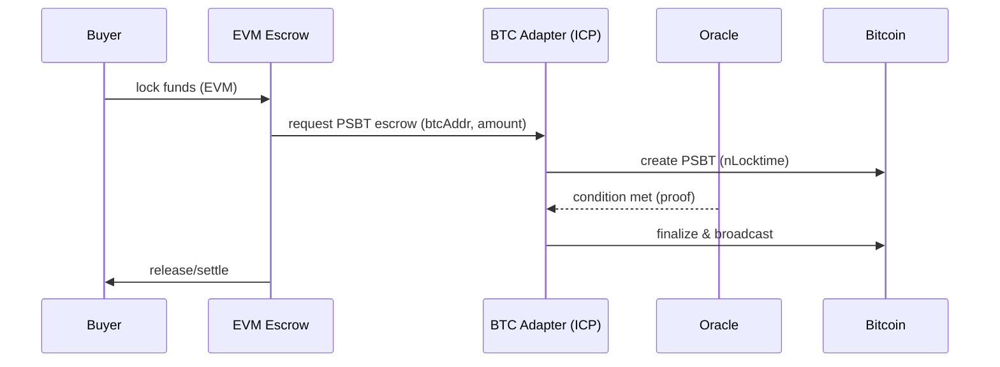
```mermaid
sequenceDiagram
  participant BUY as Buyer
  participant ESC as EVM Escrow
  participant XCS as BTC Adapter (ICP)
  participant ORA as Oracle
  participant BTC as Bitcoin

  BUY->>ESC: lock funds (EVM)
  ESC->>XCS: request PSBT escrow (btcAddr, amount)
  XCS->>BTC: create PSBT (nLocktime)
  ORA-->>XCS: condition met (proof)
  XCS->>BTC: finalize & broadcast
  ESC->>BUY: release/settle
```

---

## 9) Sequence — Payments with $QOYN/$QCNT + KYC Gate

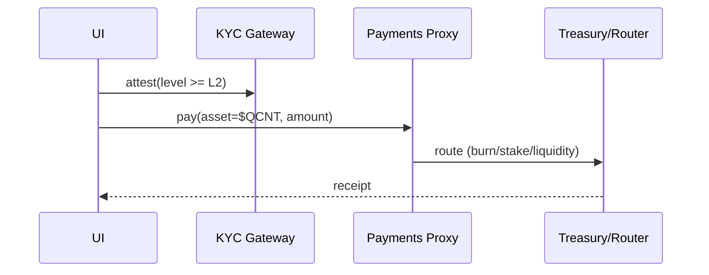
```mermaid
sequenceDiagram
  participant UI
  participant KYC as KYC Gateway
  participant PAY as Payments Proxy
  participant TRE as Treasury/Router

  UI->>KYC: attest(level >= L2)
  UI->>PAY: pay(asset=$QCNT, amount)
  PAY->>TRE: route (burn/stake/liquidity)
  TRE-->>UI: receipt
```

---

## 10) Sequence — Proof-of-State Anchor Lifecycle

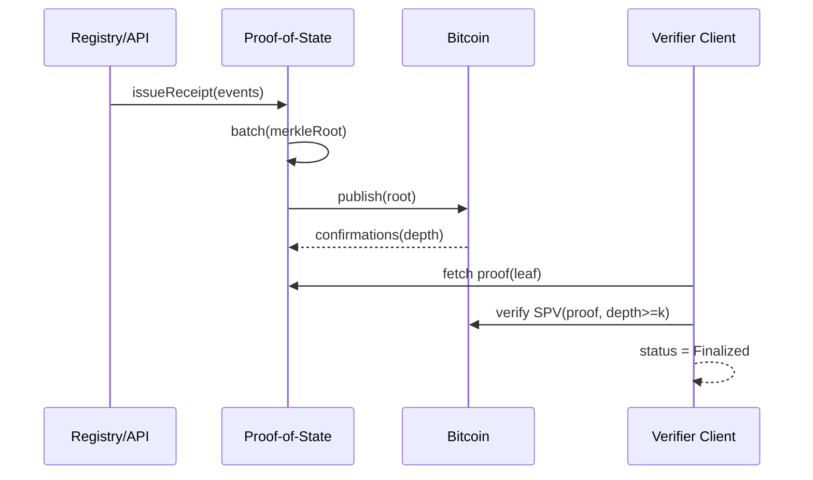
```mermaid
sequenceDiagram
  participant GW as Registry/API
  participant POS as Proof-of-State
  participant BTC as Bitcoin
  participant CLI as Verifier Client

  GW->>POS: issueReceipt(events)
  POS->>POS: batch(merkleRoot)
  POS->>BTC: publish(root)
  BTC-->>POS: confirmations(depth)
  CLI->>POS: fetch proof(leaf)
  CLI->>BTC: verify SPV(proof, depth>=k)
  CLI-->>CLI: status = Finalized
```

---

## 11) State Machine — Dual-Lock Token

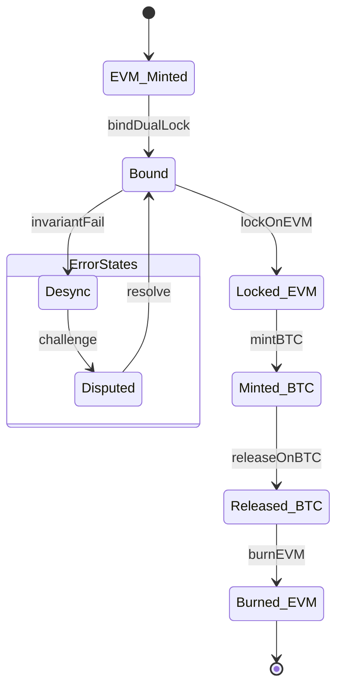
```mermaid
stateDiagram-v2
  [*] --> EVM_Minted
  EVM_Minted --> Bound: bindDualLock
  Bound --> Locked_EVM: lockOnEVM
  Locked_EVM --> Minted_BTC: mintBTC
  Minted_BTC --> Released_BTC: releaseOnBTC
  Released_BTC --> Burned_EVM: burnEVM
  Burned_EVM --> [*]

  state ErrorStates {
    Desync
    Disputed
  }
  Bound --> Desync: invariantFail
  Desync --> Disputed: challenge
  Disputed --> Bound: resolve
```

---

## 12) State Machine — Anchor Lifecycle

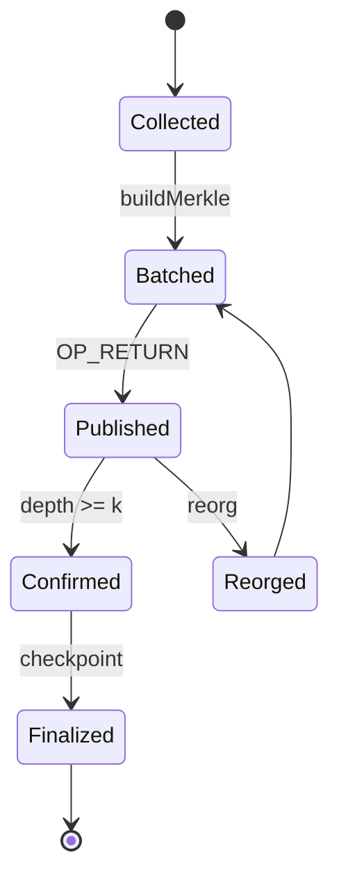
```mermaid
stateDiagram-v2
  [*] --> Collected
  Collected --> Batched: buildMerkle
  Batched --> Published: OP_RETURN
  Published --> Confirmed: depth >= k
  Confirmed --> Finalized: checkpoint
  Published --> Reorged: reorg
  Reorged --> Batched
  Finalized --> [*]
```

---

## 13) Deployment Diagram (Envs & Observability)

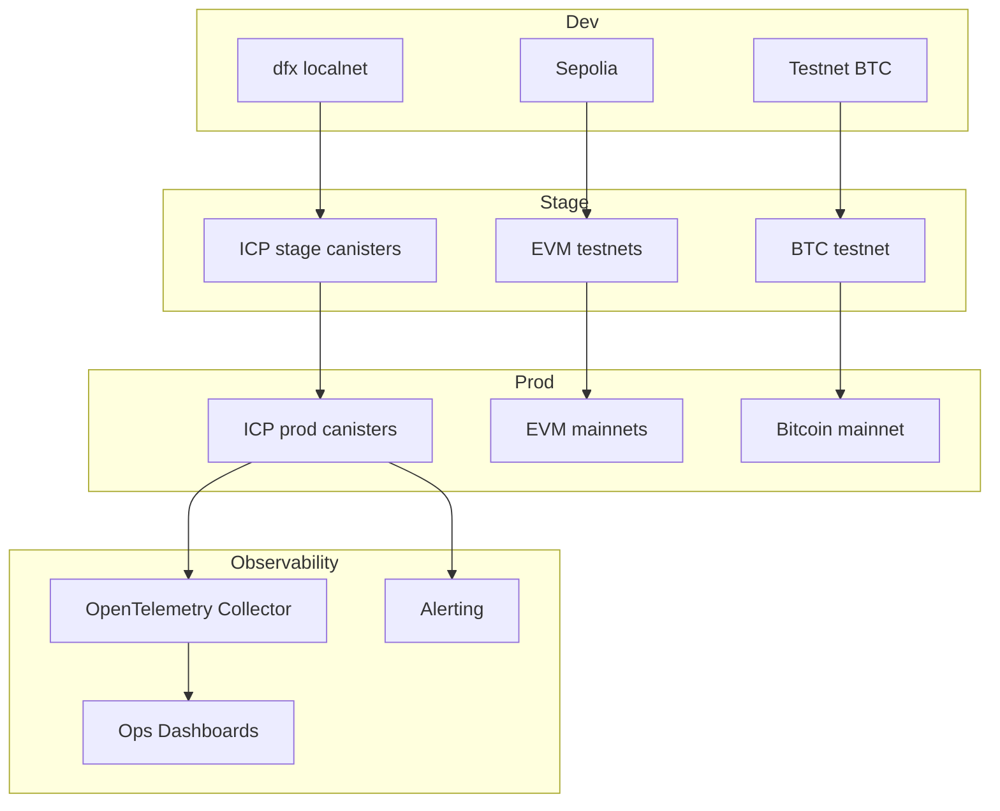
```mermaid
flowchart TB
  subgraph Dev
    dfx[dfx localnet]
    sepolia[Sepolia]
    testbtc[Testnet BTC]
  end
  subgraph Stage
    icp_stage[ICP stage canisters]
    evm_stage[EVM testnets]
    btc_stage[BTC testnet]
  end
  subgraph Prod
    icp_prod[ICP prod canisters]
    evm_prod[EVM mainnets]
    btc_main[Bitcoin mainnet]
  end

  subgraph Observability
    otel[OpenTelemetry Collector]
    dash[Ops Dashboards]
    alerts[Alerting]
  end

  dfx-->icp_stage-->icp_prod
  sepolia-->evm_stage-->evm_prod
  testbtc-->btc_stage-->btc_main
  icp_prod-->otel-->dash
  icp_prod-->alerts
```

---

## 14) Threat Model (STRIDE) — Summary Table

| Threat             | Surface                   | Control                                               |
| ------------------ | ------------------------- | ----------------------------------------------------- |
| Spoofing           | KYC/Identity, Bridge Msgs | Attestations w/ expiry; DVN quorum; sig verification  |
| Tampering          | Merkle roots, receipts    | SPV proofs; immutable logs; audits                    |
| Repudiation        | Payments, mints           | ReceiptQube + anchors; non-repudiation via signatures |
| Info Disclosure    | blakQube payloads         | Envelope encryption; tokenQube gating; RLS            |
| DoS                | Bridge/Anchors            | Rate limits; circuit breakers; backpressure           |
| Elev. of Privilege | Admin ops                 | Multi-sig; role-based access; approvals               |

---

## 15) TachiAdapter — Integration Path (Future)

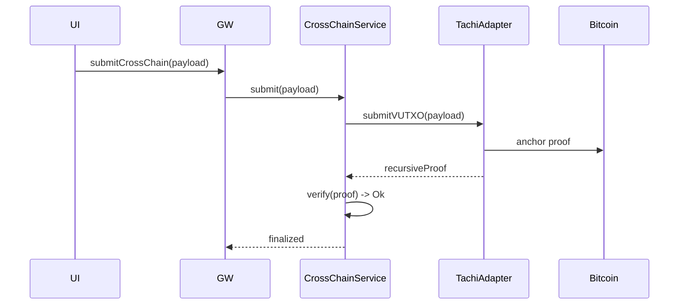
```mermaid
sequenceDiagram
  participant UI
  participant GW
  participant XCS as CrossChainService
  participant TAC as TachiAdapter
  participant BTC as Bitcoin

  UI->>GW: submitCrossChain(payload)
  GW->>XCS: submit(payload)
  XCS->>TAC: submitVUTXO(payload)
  TAC->>BTC: anchor proof
  TAC-->>XCS: recursiveProof
  XCS->>XCS: verify(proof) -> Ok
  XCS-->>GW: finalized
```

---

**Notes**

- All diagrams are intentionally **interface-driven** to keep the program modular and to de-risk future swaps (e.g., TachiAdapter).
- We’ll export SVG/PNG variants for decks once the team confirms these are the right set; source-of-truth remains Mermaid in repo `/docs/architecture/`.
