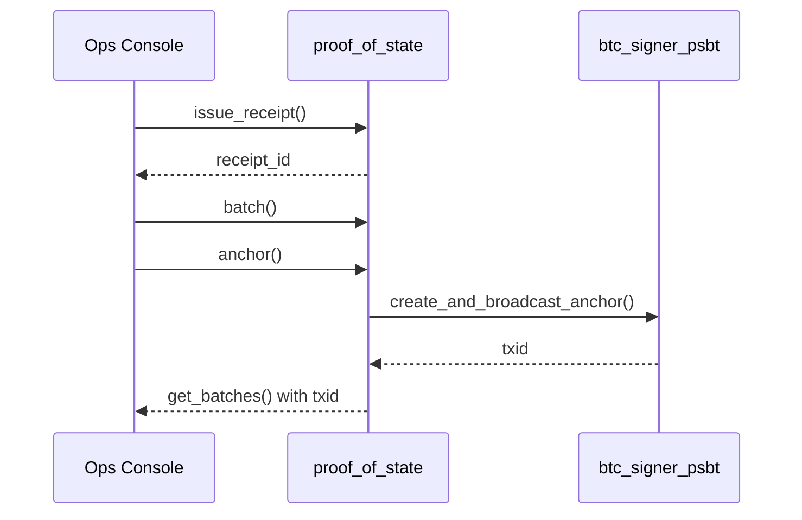

End-to-end ICP/BTC anchoring using `proof_of_state` and `btc_signer_psbt` canisters.

## Components

- `proof_of_state` (ulvla-h7777-77774-qaacq-cai)
- `btc_signer_psbt` (uxrrr-q7777-77774-qaaaq-cai)

## Flow

## Notes

- Real Bitcoin testnet HTTP outcalls via Blockstream API
- Asynchronous anchoring with fallback to mock on failure

