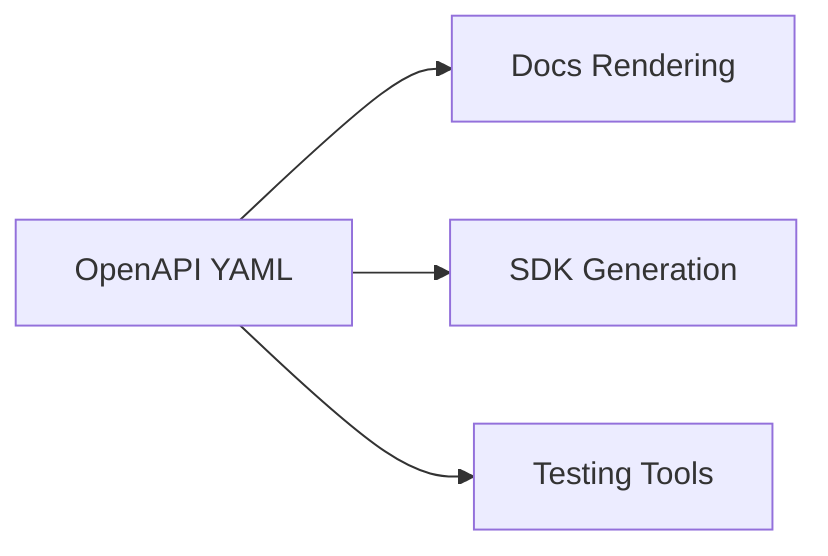

This section hosts the OpenAPI specification for the iQube Program APIs.

- The raw OpenAPI YAML lives at: `/api/openapi.yaml`
- You can render it using tools like Redoc, Scalar, or import into Postman/Insomnia.

Next steps:
- Replace the stub YAML with your full API spec.
- Optionally integrate Redoc/Scalar as a Docusaurus plugin/page for rendered API docs.

