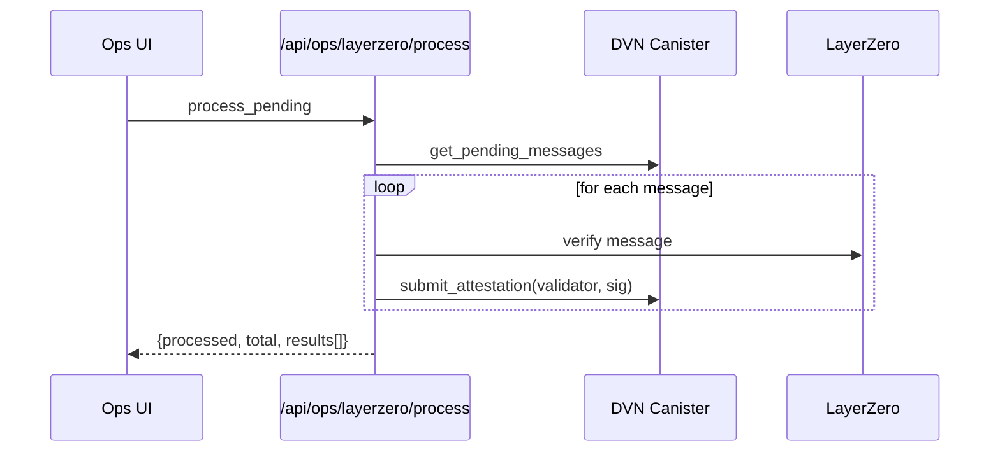
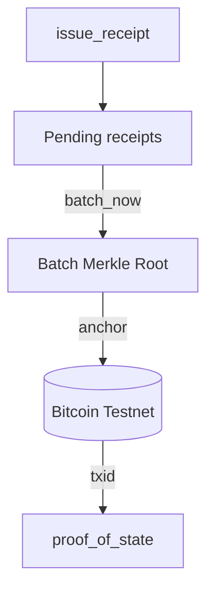

import DocCardList from '@theme/DocCardList';

# Ops Console Architecture

For full context, see:
- `apps/aigent-z/app/ops/page.tsx`
- `apps/aigent-z/app/api/ops/*`
- `apps/aigent-z/hooks/ops/*`

The Ops Console integrates ICP canisters and EVM/Non‑EVM networks, exposing diagnostics, reconciliation tools, and test flows.

Core components:
- DVN (`cross_chain_service`)
- Proof‑of‑State (`proof_of_state`)
- EVM RPC (`evm_rpc`)
- BTC Signer (`btc_signer_psbt`)
- Solana Signer (`solana_signer_ed25519`)

## Synchronization Architecture

- Sync Status API detects drift and reports severity.
- Auto‑Repair API balances state when safe.
- LayerZero Processing API processes DVN messages and submits attestations.

## Checks and Balances

- Idempotent DVN monitor to prevent duplicates.
- Lazy EVM chain initialization.
- Post‑processing refresh for eventual consistency.

## Key References

- Cross‑Chain Status: `app/api/ops/crosschain/status/route.ts`
- DVN Monitor: `app/api/ops/dvn/monitor/route.ts`
- LayerZero Processing: `app/api/ops/layerzero/process/route.ts`
- Sync: `app/api/ops/sync/*`
- Health: `app/api/ops/icp/health/route.ts`

<DocCardList />

## Diagrams

### DVN ↔ Proof-of-State Synchronization

```mermaid
flowchart LR
  subgraph EVM[Source EVM Chains]
    TX[Transaction]
  end

  TX -->|monitor_evm_transaction| DVN[DVN (cross_chain_service)]
  DVN -->|submit_dvn_message| DVNQ[Pending Messages]
  DVN -->|create_proof_of_state_receipt| PoS[Proof_of_state]

  PoS -->|issue_receipt| Pending[Pending Receipts]
  Pending -->|batch_now / batch| Batch[Batch]
  Batch -->|anchor| BTC[(Bitcoin Testnet)]

  DVNQ -->|/api/ops/layerzero/process| LZ[LayerZero Processing]
  LZ -->|submit_attestation| DVN

  classDef canister fill:#111,border:#555,color:#ddd;
  classDef ext fill:#0b3,border:#070,color:#fff;
  class DVN,PoS canister;
  class BTC ext;
```

### LayerZero Processing Flow



### Bitcoin Anchoring Lifecycle


