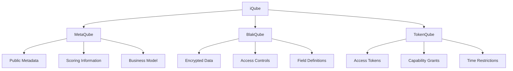

# Architecture Overview

The iQube Protocol implements a sophisticated multi-layer architecture designed to provide secure, scalable, and verifiable decentralized information management. This overview covers the core architectural principles, system components, and integration patterns.

## Architectural Philosophy

### Design Principles

#### Decentralization First
- **No Single Points of Failure**: Distributed across multiple blockchain networks
- **Censorship Resistance**: Immutable data storage and access patterns
- **Global Accessibility**: Available worldwide without geographic restrictions
- **Permissionless Innovation**: Open protocol for unrestricted development

#### Security by Design
- **Minimum Disclosure**: Default privacy with selective transparency
- **Cryptographic Verification**: All operations cryptographically verifiable
- **Zero-Knowledge Proofs**: Privacy-preserving verification mechanisms
- **Quantum Readiness**: Future-proof cryptographic implementations

#### Contextual Intelligence
- **Risk-Aware Operations**: Dynamic risk assessment and mitigation
- **Adaptive Behavior**: Context-driven decision making
- **Semantic Understanding**: Natural language processing and comprehension
- **Multi-Modal Processing**: Support for diverse data types and formats

## Core Architecture Layers

### 1. Context Layer

The Context Layer provides intelligent information processing and semantic understanding capabilities.

#### Components
- **Semantic Vectorization Engine**: Converts information into mathematical representations
- **Risk Assessment Module**: Dynamic risk scoring and evaluation
- **RAG (Retrieval Augmented Generation)**: Context-aware information retrieval
- **Multi-Modal Processor**: Handles text, images, audio, and structured data

#### Technologies
- **DB-GPT**: Semantic database querying and analysis
- **LangChain**: Advanced natural language understanding
- **Custom Risk Algorithms**: Proprietary risk vectorization
- **Vector Databases**: Efficient similarity search and retrieval

#### Responsibilities
- Generate semantic context from raw data
- Perform comprehensive risk and value analysis
- Enable intelligent information discovery
- Support multi-modal content processing

### 2. Service Layer

The Service Layer orchestrates operations across distributed services and manages external integrations.

#### Components
- **Service Registry**: Dynamic service discovery and management
- **Workflow Orchestration**: Complex multi-step operation coordination
- **API Gateway**: Unified interface for external service access
- **Resource Allocation**: Computational resource management

#### Technologies
- **AWEL (Agentic Workflow Execution Layer)**: Dynamic service composition
- **Microservices Architecture**: Scalable, independent service deployment
- **Event-Driven Design**: Asynchronous operation coordination
- **Load Balancing**: Distributed request handling

#### Responsibilities
- Coordinate complex multi-service operations
- Manage external API integrations
- Provide fault-tolerant execution
- Enable horizontal scaling

### 3. State Layer

The State Layer ensures immutable, verifiable state management across blockchain networks.

#### Components
- **Blockchain State Manager**: Multi-chain state coordination
- **Transaction Logger**: Immutable operation recording
- **Consensus Coordinator**: Cross-chain consensus management
- **Audit Trail Generator**: Comprehensive operation tracking

#### Technologies
- **Multi-Chain Integration**: Ethereum, Polygon, ICP, Bitcoin
- **Cryptographic Signatures**: Verifiable operation authentication
- **Merkle Trees**: Efficient data integrity verification
- **Threshold Cryptography**: Distributed key management

#### Responsibilities
- Maintain immutable transaction logs
- Ensure cross-chain state consistency
- Provide cryptographic verification
- Enable comprehensive auditing

## System Components

### Frontend Applications

#### Aigent Z Platform
- **Technology Stack**: Next.js 14, TypeScript, Tailwind CSS, shadcn-ui
- **Architecture**: Server-side rendering with client-side hydration
- **State Management**: React Context with localStorage persistence
- **Responsive Design**: Mobile-first, progressive enhancement

#### Network Operations Console
- **Purpose**: Real-time system monitoring and diagnostics
- **Integration**: Embedded within Aigent Z Settings menu
- **Data Sources**: Live blockchain RPC endpoints and ICP canisters
- **Update Frequency**: 30-second automatic refresh intervals

### Backend Services

#### Next.js API Routes
- **Registry Management**: `/api/registry/*` - iQube template and instance operations
- **Core Operations**: `/api/core/*` - Application logic and processing
- **Network Operations**: `/api/ops/*` - Blockchain and canister monitoring
- **Development Tools**: `/api/dev/*` - Development and testing utilities

#### ICP Canisters
- **proof_of_state**: Receipt generation and batch processing
- **btc_signer_psbt**: Bitcoin transaction signing with threshold ECDSA
- **cross_chain_service**: LayerZero DVN integration and cross-chain messaging
- **evm_rpc**: EVM chain RPC interface and transaction monitoring

### Blockchain Integration

#### Ethereum Ecosystem
- **Ethereum Mainnet**: Production deployments and mainnet operations
- **Ethereum Sepolia**: Live testnet integration for development and testing
- **Layer 2 Solutions**: Polygon and other scaling solutions
- **Smart Contracts**: iQube registry and access control contracts

#### Internet Computer Protocol (ICP)
- **Canister Architecture**: WebAssembly-based smart contracts
- **Threshold Cryptography**: Distributed key management and signing
- **Cross-Chain Integration**: Bitcoin and Ethereum connectivity
- **Decentralized Storage**: Immutable data storage and retrieval

#### Bitcoin Network
- **Bitcoin Testnet**: Development and testing integration
- **Anchor Transactions**: Immutable timestamping and verification
- **PSBT (Partially Signed Bitcoin Transactions)**: Multi-signature workflows
- **Threshold ECDSA**: Distributed Bitcoin key management

### Data Architecture

#### iQube Structure

#### Data Flow Patterns
- **Template → Instance**: Reusable templates create specific instances
- **Library → Registry**: Local drafts become public or private registry entries
- **Encryption → Decryption**: Secure data access with capability tokens
- **Minting → Activation**: Blockchain registration enables full functionality

### Integration Patterns

#### API-First Design
- **RESTful Interfaces**: Standard HTTP methods and status codes
- **GraphQL Support**: Flexible query capabilities for complex data
- **WebSocket Connections**: Real-time updates and notifications
- **Rate Limiting**: Protection against abuse and overuse

#### Event-Driven Architecture
- **Event Sourcing**: Complete operation history reconstruction
- **Message Queues**: Asynchronous operation processing
- **Pub/Sub Patterns**: Decoupled component communication
- **Event Replay**: System state reconstruction from events

#### Microservices Coordination
- **Service Discovery**: Dynamic service location and health checking
- **Circuit Breakers**: Fault tolerance and graceful degradation
- **Distributed Tracing**: End-to-end operation visibility
- **Centralized Logging**: Unified log aggregation and analysis

## Security Architecture

### Cryptographic Foundations

#### Encryption Schemes
- **AES-256**: Symmetric encryption for bulk data
- **RSA-4096**: Asymmetric encryption for key exchange
- **ECDSA**: Digital signatures and authentication
- **Threshold Cryptography**: Distributed key management

#### Zero-Knowledge Proofs
- **zk-SNARKs**: Succinct non-interactive proofs
- **zk-STARKs**: Scalable transparent proofs
- **Bulletproofs**: Range proofs and confidential transactions
- **Commitment Schemes**: Data hiding with later revelation

### Access Control

#### Capability-Based Security
- **Capability Tokens**: Time-limited access grants
- **Principle of Least Privilege**: Minimal necessary permissions
- **Revocable Access**: Dynamic permission management
- **Audit Trails**: Complete access logging

#### Multi-Factor Authentication
- **Wallet-Based Auth**: Cryptographic identity verification
- **Biometric Integration**: Hardware security key support
- **Social Recovery**: Distributed account recovery mechanisms
- **Session Management**: Secure session handling and timeout

### Privacy Protection

#### Data Minimization
- **Selective Disclosure**: Reveal only necessary information
- **Differential Privacy**: Statistical privacy guarantees
- **Homomorphic Encryption**: Computation on encrypted data
- **Secure Multi-Party Computation**: Collaborative computation without data sharing

## Performance and Scalability

### Horizontal Scaling

#### Load Distribution
- **Geographic Distribution**: Global content delivery networks
- **Service Replication**: Multiple instances for high availability
- **Database Sharding**: Distributed data storage
- **Caching Strategies**: Multi-level caching for performance

#### Auto-Scaling
- **Demand-Based Scaling**: Automatic resource adjustment
- **Predictive Scaling**: Proactive resource provisioning
- **Cost Optimization**: Efficient resource utilization
- **Performance Monitoring**: Real-time performance tracking

### Optimization Strategies

#### Frontend Optimization
- **Code Splitting**: Lazy loading for faster initial loads
- **Asset Optimization**: Compressed images and minified code
- **CDN Integration**: Global content distribution
- **Progressive Enhancement**: Graceful degradation for older browsers

#### Backend Optimization
- **Database Indexing**: Optimized query performance
- **Connection Pooling**: Efficient database connections
- **Caching Layers**: Redis and in-memory caching
- **Async Processing**: Non-blocking operation handling

## Monitoring and Observability

### System Monitoring

#### Real-Time Metrics
- **Performance Metrics**: Response times, throughput, error rates
- **Resource Utilization**: CPU, memory, network, storage
- **Business Metrics**: User engagement, transaction volumes
- **Security Metrics**: Authentication failures, access patterns

#### Alerting Systems
- **Threshold-Based Alerts**: Automated notifications for metric violations
- **Anomaly Detection**: Machine learning-based unusual pattern detection
- **Escalation Procedures**: Automated escalation for critical issues
- **Integration**: Slack, email, and mobile notifications

### Distributed Tracing

#### Request Tracking
- **End-to-End Visibility**: Complete request journey tracking
- **Performance Bottlenecks**: Identify slow components
- **Error Attribution**: Precise error source identification
- **Dependency Mapping**: Service interaction visualization

## Future Architecture Evolution

### Planned Enhancements

#### Advanced AI Integration
- **Multi-Agent Systems**: Coordinated AI agent collaboration
- **Federated Learning**: Distributed model training
- **Autonomous Operations**: Self-managing system components
- **Predictive Analytics**: Proactive issue identification

#### Blockchain Evolution
- **Layer 2 Integration**: Advanced scaling solutions
- **Cross-Chain Protocols**: Enhanced interoperability
- **Quantum-Resistant Cryptography**: Future-proof security
- **Decentralized Governance**: Community-driven protocol evolution

#### Performance Improvements
- **Edge Computing**: Computation closer to users
- **Advanced Caching**: Intelligent cache management
- **Protocol Optimization**: Reduced overhead and latency
- **Resource Efficiency**: Improved computational efficiency

---

*The iQube Protocol architecture provides a robust, scalable foundation for decentralized information management while maintaining the flexibility to evolve with emerging technologies and user needs.*
