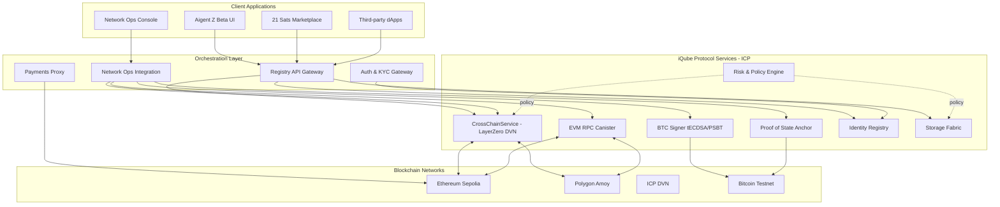

# iQube Protocol System Architecture

## Overview

The iQube Protocol implements a sophisticated multi-layer architecture that bridges Internet Computer Protocol (ICP) with Bitcoin and cross-chain operations through LayerZero's Decentralized Verifier Network (DVN). The system enables secure, verifiable, and automated cross-chain transactions with real-time monitoring capabilities.

## 🏗️ Architectural Layers

The protocol operates on a four-layer architectural model:

### 1. Orchestration Layer
- **Aigent Z Application**: Unified intelligence agent platform
- **Network Operations Console**: Integrated Web3 monitoring (Settings → Network Ops)
- **21 Sats Market**: Bitcoin marketplace application
- **Registry Gateway**: API gateway for iQube operations

### 2. Context Layer
- **iQube Management**: MetaQube, BlakQube, TokenQube operations
- **Dynamic Context Generation**: RAG and semantic processing
- **Identity Registry**: DIDQube and FIO integration
- **Risk and Policy Engine**: Compliance and governance

### 3. Service Layer
- **Cross-Chain Service**: LayerZero DVN integration on ICP
- **EVM RPC Canister**: Ethereum Virtual Machine interactions
- **BTC Signer**: tECDSA and PSBT Bitcoin operations
- **Proof of State**: Anchoring and verification service

### 4. State Layer
- **ICP Canisters**: Blockchain-backed state persistence
- **Bitcoin Network**: L1 anchoring and settlement
- **EVM Chains**: Smart contract interactions
- **Storage Fabric**: Decentralized data management

## 🔗 System Integration Flow

## 🚀 Major Integration Achievement: Web3 Ops Console

**Strategic Integration**: The complete Web3 Ops Console functionality has been successfully integrated into the Aigent Z application as Settings → Network Ops, creating a unified testing and operational environment that bridges Web3 development with user-facing application functionality.

### Integration Benefits
- **Unified Testing Environment**: End-to-end testing of mint functions within familiar AigentZ interface
- **Parallel Development**: Simultaneous UX/UI and Web3 functionality testing and development
- **Production Readiness**: Operational monitoring directly accessible to users within main application
- **Cross-Workstream Bridge**: Seamless connection between Web3 backend development and frontend application

### Technical Implementation
The integration provides:
- Live blockchain monitoring (Ethereum Sepolia, Polygon Amoy, ICP DVN, BTC)
- Real-time canister health monitoring with 30-second refresh intervals
- End-to-end testing interface for mint functions and Supabase integration
- Production-ready operational visibility within the main application interface

## 🔧 Core Components

### ICP Canisters

#### 1. Proof of State Canister
- **Purpose**: Bitcoin anchoring and cryptographic proof system
- **Functions**: Receipt generation, batch processing, Bitcoin anchoring
- **Status**: Deployed and operational with live Bitcoin testnet integration

#### 2. Cross-Chain Service Canister
- **Purpose**: LayerZero DVN message verification and cross-chain operations
- **Functions**: DVN message processing, attestation management, EVM transaction monitoring
- **Status**: Live integration with LayerZero network

#### 3. BTC Signer Canister
- **Purpose**: Bitcoin transaction signing using tECDSA
- **Functions**: Address generation, transaction creation, PSBT signing
- **Status**: Connected to Bitcoin testnet with real transaction capabilities

#### 4. EVM RPC Canister
- **Purpose**: Ethereum Virtual Machine chain interactions
- **Functions**: Transaction receipts, block information, RPC gateway
- **Status**: Live connections to Ethereum Sepolia and Polygon Amoy

### Blockchain Networks

#### Live Testnet Integration
- **Ethereum Sepolia**: Live RPC monitoring via Infura endpoints
- **Polygon Amoy**: Live RPC monitoring via official Polygon endpoints
- **ICP DVN**: Real-time canister health and cross-chain services
- **Bitcoin Testnet**: Live transaction signing and broadcasting

**No mock or demonstration data** - all monitoring uses live testnet data from real blockchain networks and deployed ICP canisters.

## 🎯 Key Features

### Real-Time Monitoring
- 30-second refresh intervals for all blockchain data
- Live canister health status tracking
- Cross-chain message verification
- Transaction monitoring and validation

### Security & Compliance
- Cryptographic proof verification
- Multi-signature transaction support
- Policy-based access controls
- Audit trail maintenance

### Scalability & Performance
- Efficient batch processing for Bitcoin anchoring
- Optimized RPC gateway patterns
- Caching strategies for improved response times
- Load balancing across multiple endpoints

## 🔄 Data Flow Patterns

### 1. iQube Operations Flow
1. User initiates operation in Aigent Z interface
2. Request routed through Registry API Gateway
3. ICP canisters process business logic
4. State changes anchored to Bitcoin
5. Cross-chain messages propagated via LayerZero DVN
6. Real-time status updates via Network Ops console

### 2. Cross-Chain Message Flow
1. Message submitted to CrossChainService canister
2. DVN validators process attestations
3. Quorum reached (2+ attestations required)
4. Message ready for execution
5. EVM transaction monitoring initiated
6. LayerZero endpoint verification completed

### 3. Bitcoin Anchoring Flow
1. Receipt generated for data
2. Multiple receipts batched into Merkle tree
3. Root hash submitted to BTC Signer canister
4. tECDSA signature generated
5. Transaction broadcast to Bitcoin testnet
6. Confirmation tracked and verified

## 🛡️ Security Architecture

### Multi-Layer Security
- **Cryptographic Proofs**: Bitcoin-backed immutability
- **Consensus Mechanisms**: DVN validator quorum requirements
- **Access Controls**: Policy-based permissions and capability tokens
- **Audit Trails**: Comprehensive logging and monitoring

### Privacy Features
- **BlakQube**: Encrypted private data with selective disclosure
- **TokenQube**: Token-gated access controls
- **MetaQube**: Public metadata with privacy-preserving patterns

## 📊 Performance Characteristics

### Throughput Metrics
- **Receipt Processing**: &lt;1 second per receipt
- **Batch Creation**: &lt;5 seconds for batches up to 100 receipts
- **Bitcoin Anchoring**: 10-60 minutes (Bitcoin network dependent)
- **Cross-Chain Verification**: 2-10 minutes (validator network dependent)

### Reliability Targets
- **System Uptime**: 99.9% target
- **Data Integrity**: 100% (cryptographically guaranteed)
- **Cross-Chain Success Rate**: &gt;99% (DVN validator consensus)
- **Bitcoin Confirmation Rate**: 100% (testnet operations)

## 🔮 Future Architecture Evolution

### Planned Enhancements
- **TachiAdapter Integration**: Enhanced cross-chain capabilities
- **Layer 2 Solutions**: Optimistic/ZK rollup research and development
- **Enhanced Privacy**: Advanced zero-knowledge proof integration
- **Scalability Improvements**: Sharding and parallel processing

### Integration Roadmap
- **Production Deployment**: Full mainnet launch preparation
- **21 Sats Market Integration**: Consumer marketplace launch
- **Third-Party APIs**: External service integrations
- **Mobile Applications**: Native mobile app development

---

This architecture provides a robust, scalable foundation for the iQube Protocol while maintaining flexibility for future enhancements and integrations.
