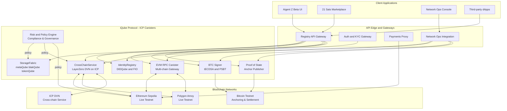
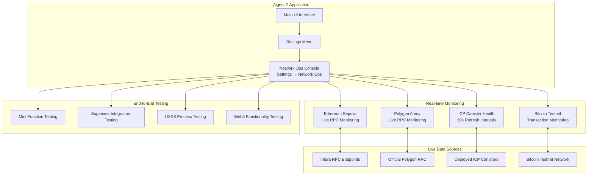
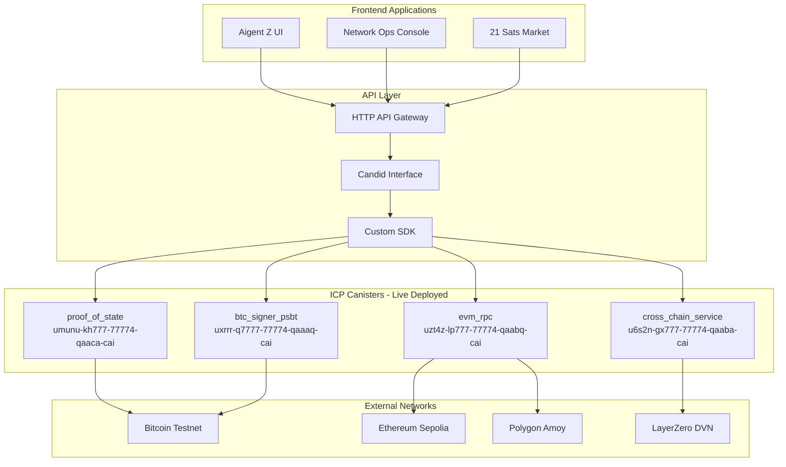
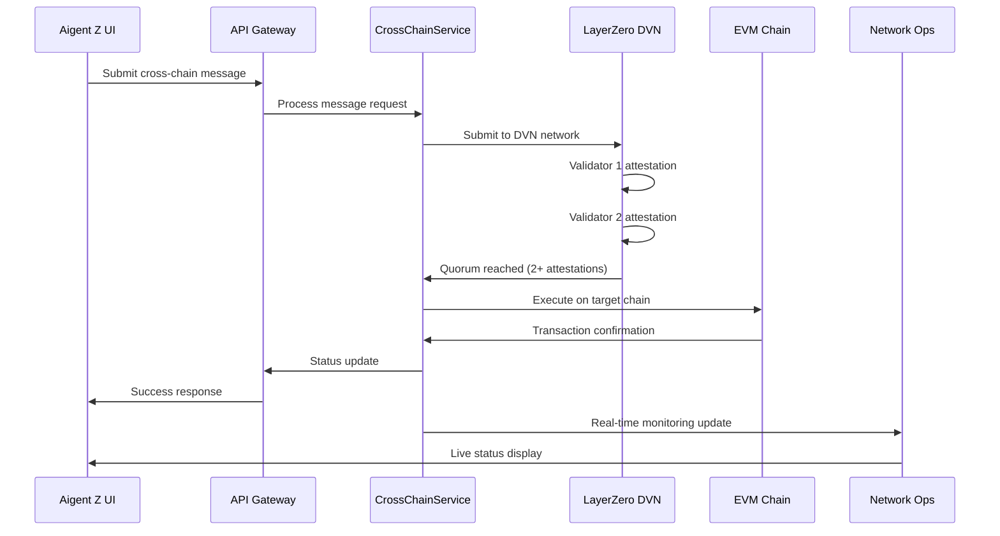
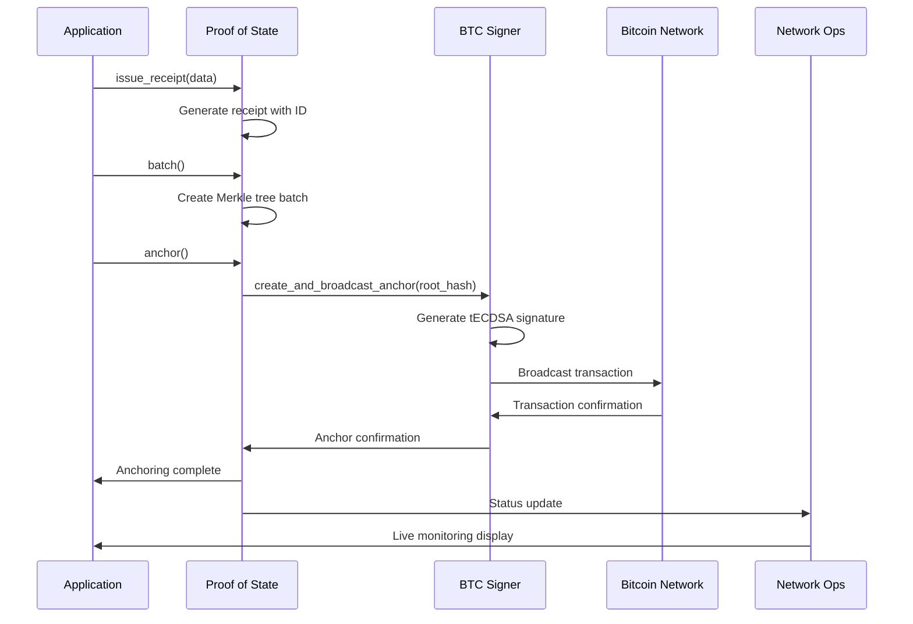
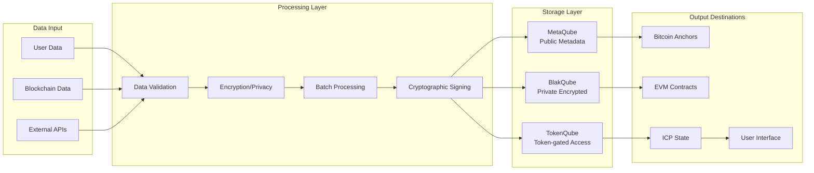
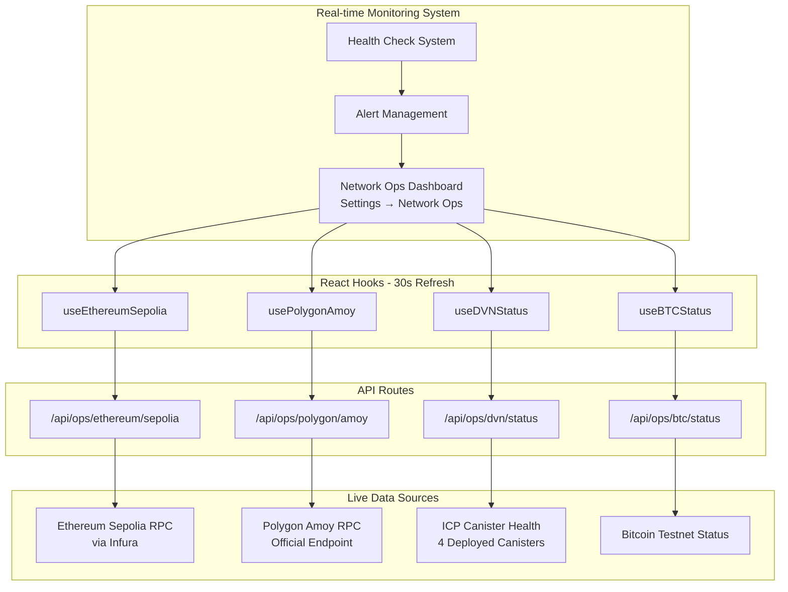
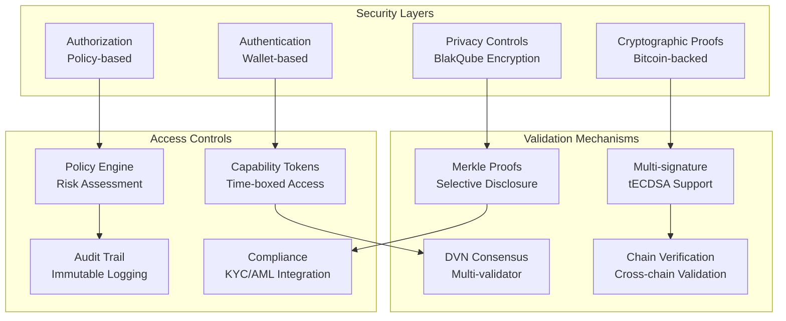
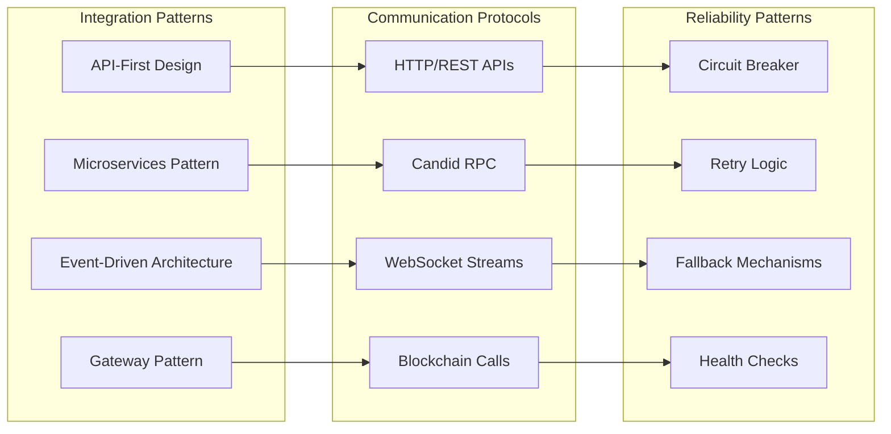
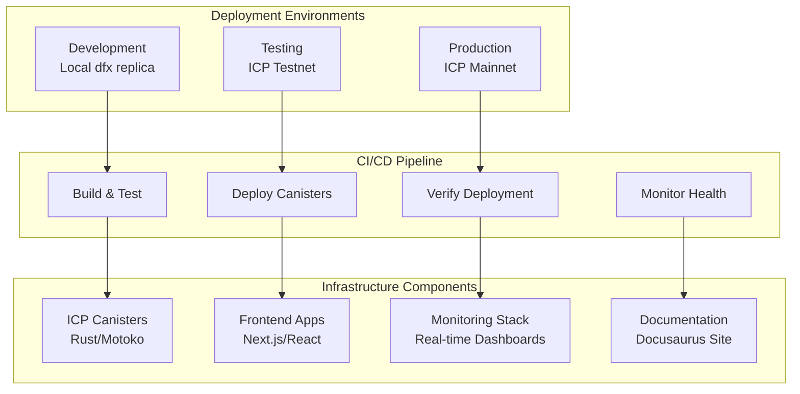

# Technical Architecture Diagrams

This document provides comprehensive technical diagrams for the iQube Protocol architecture, including system components, data flows, and integration patterns.

## 1. Layered Architecture & Trust Boundaries

## 2. Web3 Ops Console Integration Architecture

**MAJOR ACHIEVEMENT**: Complete Web3 Ops Console functionality integrated into Aigent Z application.

## 3. ICP Canister Architecture

## 4. Cross-Chain Message Flow

## 5. Bitcoin Anchoring Flow

## 6. Data Flow Architecture

## 7. Network Operations Monitoring Architecture

## 8. Security Architecture

## 9. Integration Patterns

## 10. Deployment Architecture

---

These diagrams provide a comprehensive view of the iQube Protocol architecture, highlighting the successful integration of Web3 Ops Console functionality into the Aigent Z application and the live testnet integrations across multiple blockchain networks.
