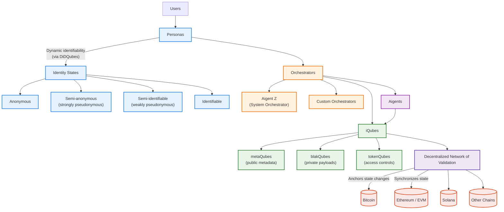
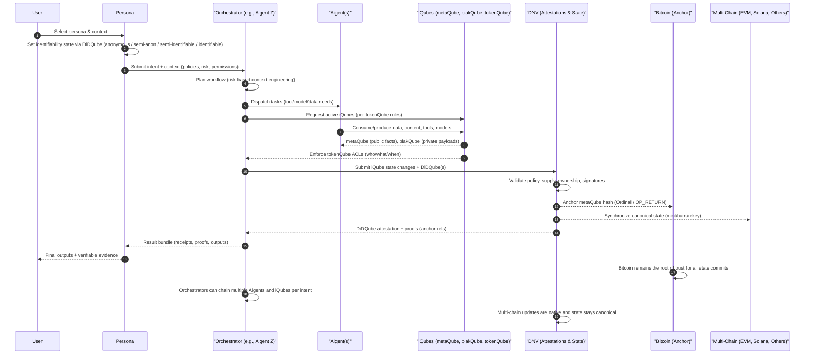

# Why iQubes Matter

The iQube Protocol provides the infrastructure for the agentic internet: a new paradigm where information, identities, and AI agents interact across chains in a secure, verifiable, and privacy-preserving way. Just as blockchains made money programmable, iQubes make knowledge intelligent, autonomous and programmable.

## What iQubes Are

iQubes are atomic, verifiable information assets. Each iQube packages:

- metaQubes: public, anonymous metadata shared on the network.
- blakQubes: private payloads, encrypted and selectively accessible.
- tokenQubes: cryptographic keys that enforce access and control.

Together, these allow knowledge and intelligence to be:

- Verifiable (anchored to Bitcoin through the Decentralized Network of Validation, or DNV).
- Interoperable (usable across Bitcoin, Ethereum, Solana, and other chains without bridges).
- Context-aware (enriched with risk profiles and usage permissions).
- Composable (combined into clusters of data, content, tools, models, and agents).

Users interact with active iQubes—those they have rights to access via the iQube Registry and rules enforced by tokenQubes.

## The Role of the DNV

The Decentralized Network of Validation (DNV) is the backbone of trust:

- Anchors all iQube state changes to Bitcoin, the world’s most secure ledger.
- Issues DiDQubes (digital identity/data attestations) that certify each action.
- Provides a single canonical state across chains, eliminating the need for wrapped tokens or custodial pools.
- Maintains four states of identifiability for users and agents:
  - Anonymous
  - Semi-anonymous (strongly pseudonymous)
  - Semi-identifiable (weakly pseudonymous)
  - Identifiable

This enables privacy at the network level while allowing verifiable compliance (KYC/AML, risk scoring, policy enforcement) at the application level when needed.

## Personas, Aigents, and Orchestrators

### Personas: Contextual User Identities
A persona is the role and context in which a user interacts with the ecosystem.

- Users can maintain multiple personas with different identifiability states, managed dynamically via DiDQubes.
- Current system personas:
  - Qripto Persona: a professional, all-purpose Web3 identity.
  - KNYT Persona: tied to the metaKnyts QriptoMedia franchise, onboarding users into the ecosystem.
  - metaMe Persona: a configurable personal identity calibrated to each user’s unique context.
- Users will soon be able to design and configure their own personas.

### Aigents: AI Agents Using iQubes
Aigents are autonomous AI agents that operate using iQubes, in compliance with the iQube Protocol.

- They leverage active iQubes (data, content, tools, models, or other agents) to execute tasks for users.
- Like users, Aigents can have identities and contexts, expressed through DiDQubes.

### Orchestrators: A Special Class of Aigents
Orchestrator Aigents coordinate multiple Aigents and iQubes to deliver complex services.

- They enable composability: combining clusters of iQubes into workflows or solutions.
- Aigent Z is the system’s primary orchestrator—managing agents, user context, and service orchestration.
- Users can also create their own orchestrators, publish them to the Registry, and choose to keep them private or offer them publicly under business models enforced automatically by the protocol.

## High-Level Summary

- iQubes make information programmable: verifiable, composable, and portable across chains.
- The DNV ensures every action is anchored to Bitcoin and reconciled across ecosystems.
- DiDQubes provide dynamic, risk-aware identity states—solving the tension between privacy and compliance.
- Personas let users shift contexts and identities intelligently.
- Aigents are AI agents powered by iQubes.
- Orchestrators like Aigent Z manage agents and iQubes to deliver adaptive, multi-context services.

Together, these elements create a secure, interoperable, and efficient foundation for agentic AI and the next phase of the internet.

---

## Sidebar Colors Preview

The Aigent Z sidebar shows distinct colors for iQubes submenu headers and icons to improve quick navigation.

---

## Architecture Overview Diagram

## Sequence of Interaction

