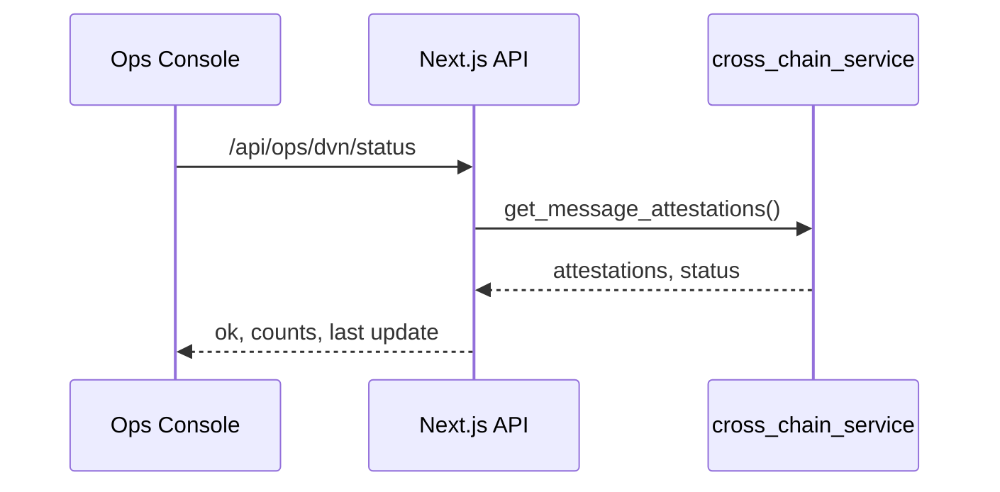

The `cross_chain_service` canister provides LayerZero DVN quorum verification and cross-chain messaging utilities.

## Canister Overview

- ID: `u6s2n-gx777-77774-qaaba-cai`
- Key APIs:
  - `submit_dvn_message`
  - `get_dvn_message`
  - `submit_attestation`
  - `get_message_attestations`
  - `monitor_evm_transaction`
  - `verify_layerzero_message`

## Operations

- Quorum: 2 attestations required for execution
- Monitoring: DVN status surfaced in Ops Console DVN card
- Errors: network failures return `ok: false` with detailed message

