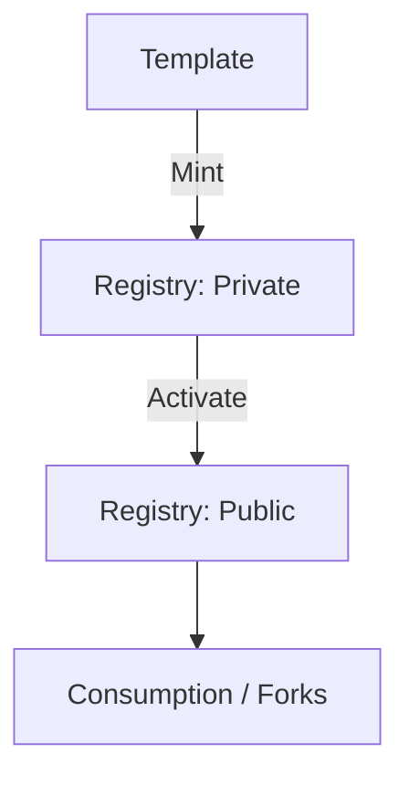

Qoyn provides economic primitives and tokenization models used across the iQube ecosystem.

## Concepts

- Minting and activation flows
- Access control via TokenQube
- Registry visibility: Public vs Private

