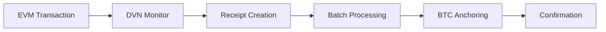

# Cross-Chain Operations

The iQube Protocol implements comprehensive cross-chain operations through the Operations Console, enabling seamless monitoring and management of transactions across multiple blockchain networks. This guide covers EVM transaction creation, DVN (Decentralized Verifier Network) monitoring, and BTC anchoring operations.

## Overview

Cross-chain operations in iQube Protocol follow this workflow:

### Key Components

- **EVM Networks**: Ethereum Sepolia and Polygon Amoy testnets
- **DVN System**: LayerZero-based decentralized verification
- **ICP Canisters**: proof_of_state, cross_chain_service, btc_signer_psbt
- **BTC Integration**: Bitcoin testnet anchoring and verification

## EVM Transaction Operations

### MetaMask Integration

The Operations Console provides direct MetaMask integration for creating test transactions:

#### Supported Networks
- **Ethereum Sepolia** (Chain ID: 11155111)
- **Polygon Amoy** (Chain ID: 80002)

#### Transaction Creation Process

1. **Access DVN Card**: Navigate to the DVN monitoring card in Operations Console
2. **Select Network**: Choose from dropdown (Sepolia or Amoy)
3. **Create Transaction**: Click "Create Test TX (MetaMask)"
4. **MetaMask Interaction**: 
   - Automatic chain switching if needed
   - Self-transfer transaction (0 value)
   - User confirms transaction in MetaMask
5. **Transaction Tracking**: Hash is automatically captured and displayed

#### Transaction Monitoring

After transaction creation:

1. **Automatic Monitoring**: Transaction hash is automatically monitored
2. **Status Updates**: Real-time status updates as transaction confirms
3. **Persistence**: Transaction hash persists across page refreshes
4. **Explorer Links**: Direct links to blockchain explorers for verification

### Manual Transaction Monitoring

You can also monitor existing transactions:

1. **Input Transaction Hash**: Paste any valid EVM transaction hash
2. **Select Network**: Choose appropriate network (Sepolia/Amoy)
3. **Start Monitoring**: Click "Monitor" to begin tracking
4. **Status Display**: View confirmation status and details

## DVN (Decentralized Verifier Network) Operations

### DVN Architecture

The DVN system processes cross-chain messages through LayerZero protocol integration:

#### Core Components
- **cross_chain_service Canister**: Main DVN logic and message processing
- **Message Queue**: Pending messages awaiting verification
- **Attestation System**: Multi-validator message verification
- **Verification Engine**: LayerZero message validation

### DVN Monitoring Workflow

#### Message Processing States
1. **Submitted**: Message submitted to DVN for processing
2. **Monitored**: EVM transaction being tracked
3. **Attested**: Message verified by validators
4. **Verified**: Final verification complete
5. **Executed**: Cross-chain operation completed

#### Current Status (September 2025)

:::warning DVN Canister Dependencies
The DVN canister currently has dependency issues causing `canister_not_found` errors. A comprehensive fallback system is in place:

- **Fallback Monitoring**: Uses direct RPC queries when canister unavailable
- **Local Tracking**: Messages tracked as `local:txHash` format
- **Status Persistence**: Transaction status maintained across sessions
- **Recovery Path**: Automatic recovery when canister becomes available
:::

### DVN Fallback System

When the DVN canister is unavailable, the system automatically:

1. **Detects Failure**: Identifies `canister_not_found` errors
2. **Activates Fallback**: Switches to local RPC monitoring
3. **Maintains Functionality**: Continues transaction tracking
4. **Preserves Data**: Keeps transaction hashes and status
5. **Provides Feedback**: Clear indication of fallback mode

#### Fallback Features
- **Direct RPC Queries**: Queries Amoy/Sepolia RPC directly
- **Transaction Receipts**: Retrieves and displays transaction status
- **Status Mapping**: Maps RPC data to DVN-compatible format
- **Seamless UX**: Users experience minimal disruption

## BTC Anchoring Operations

### Anchor System Architecture

Bitcoin anchoring creates immutable records of cross-chain operations:

#### Components
- **proof_of_state Canister**: Manages receipts and batches
- **btc_signer_psbt Canister**: Bitcoin transaction signing
- **BTC Testnet**: Bitcoin testnet for anchor transactions

### Anchor Workflow

#### Expected Process
1. **Receipt Creation**: DVN creates receipt in proof_of_state
2. **Batch Formation**: Multiple receipts grouped into batches
3. **Merkle Root**: Batch root calculated for anchoring
4. **BTC Transaction**: Anchor transaction created and signed
5. **Broadcast**: Transaction broadcast to Bitcoin testnet
6. **Confirmation**: Transaction confirmed in Bitcoin block

#### Current Status (September 2025)

:::info Anchor Development Status
BTC anchoring is currently in diagnostic mode:

- **Canister Connectivity**: ✅ proof_of_state canister reachable
- **Available Methods**: `get_batches`, `get_pending_count` (query methods)
- **Missing Methods**: `issue_receipt`, `batch`, `anchor` (update methods)
- **Status**: Requires canister redeployment with full functionality
:::

### Anchor Diagnostics

The anchor system provides detailed diagnostic information:

#### Available Information
- **Canister Status**: Connection health to proof_of_state
- **Batch Count**: Number of existing batches (currently 0)
- **Pending Receipts**: Count of pending receipts
- **Method Availability**: List of available canister methods

#### Diagnostic Testing
1. **Click Anchor Button**: Attempts to create test anchor
2. **Method Detection**: Shows available vs. required methods
3. **Error Analysis**: Detailed error messages with next steps
4. **Status Reporting**: Clear indication of current limitations

## BTC Testnet Integration

### Network Monitoring

Bitcoin testnet integration provides:

#### Real-Time Data
- **Block Height**: Current Bitcoin testnet block height
- **Network Status**: Connection health to BTC testnet
- **API Reliability**: Dual-API approach for resilience

#### API Endpoints
- **Primary**: mempool.space/testnet/api
- **Fallback**: blockstream.info/testnet/api
- **Timeout**: 5-second timeout per API
- **Caching**: 10-minute client-side cache

### Reliability Features

#### Dual-API System
1. **Primary Attempt**: Try mempool.space first
2. **Automatic Fallback**: Switch to blockstream.info on failure
3. **Status Display**: Shows which API is currently active
4. **Performance Tracking**: Monitors response times

#### Client-Side Caching
- **Cache Duration**: 10 minutes for block height data
- **Fallback Display**: Shows cached data with age indicator
- **Automatic Refresh**: Attempts to refresh every 30 seconds
- **Resilience**: Maintains functionality during API outages

## Operational Procedures

### Daily Operations Checklist

#### Morning Health Check
1. **Access Operations Console**: Navigate to `/ops` in Aigent Z
2. **Verify Network Status**: All cards should show green indicators
3. **Check Response Times**: Should be < 2 seconds for all services
4. **Review Error Logs**: Check browser console for any issues
5. **Test Transaction Flow**: Create and monitor a test transaction

#### Transaction Monitoring
1. **Create Test Transaction**: Use MetaMask integration
2. **Verify DVN Monitoring**: Confirm transaction appears in DVN card
3. **Check Status Updates**: Monitor confirmation progress
4. **Validate Persistence**: Refresh page and verify transaction remains
5. **Review Explorer Links**: Verify external explorer integration

### Troubleshooting Procedures

#### DVN Monitoring Issues

**Symptom**: DVN monitoring fails or shows errors
**Diagnosis Steps**:
1. Check browser console for `canister_not_found` errors
2. Verify transaction hash format and network selection
3. Confirm MetaMask network matches selected network
4. Test with known good transaction hash

**Resolution**:
- System automatically activates fallback mode
- Transaction tracking continues via direct RPC
- Status shows as `local:txHash` format
- Full functionality maintained

#### BTC Testnet Connectivity Issues

**Symptom**: Block height shows "—" or red status
**Diagnosis Steps**:
1. Check both mempool.space and blockstream.info APIs
2. Verify network connectivity
3. Check for rate limiting or API quotas
4. Review cached data age

**Resolution**:
- System automatically tries fallback API
- Cached data displayed with age indicator
- Manual refresh attempts new API calls
- Service recovers automatically when APIs available

#### Anchor Functionality Issues

**Symptom**: "Anchor functionality not yet implemented" message
**Diagnosis**: Expected behavior - canister needs redeployment
**Information Provided**:
- Available methods: `get_batches`, `get_pending_count`
- Missing methods: `issue_receipt`, `batch`, `anchor`
- Canister ID and connectivity status

**Next Steps**:
- Monitor for canister redeployment updates
- Use diagnostic information for development planning
- Continue monitoring other system components

### Performance Monitoring

#### Key Metrics
- **Page Load Time**: < 3 seconds for Operations Console
- **Network Updates**: 30-second refresh intervals
- **Fallback Activation**: < 5 seconds when primary services fail
- **Transaction Confirmation**: 1-3 minutes depending on network

#### Performance Optimization
- **Parallel API Calls**: Multiple network status checks run concurrently
- **Efficient Caching**: Minimize redundant API calls
- **Graceful Degradation**: Maintain functionality during service issues
- **User Feedback**: Clear indication of system status and limitations

## Future Enhancements

### Planned Improvements

#### Phase 1: Infrastructure Fixes
- **DVN Canister Redeployment**: Fix dependency canister IDs
- **Anchor Method Implementation**: Deploy full anchor functionality
- **Enhanced Error Handling**: Improved error messages and recovery

#### Phase 2: Feature Enhancements
- **Transaction History**: Persistent transaction tracking
- **Advanced Analytics**: Performance metrics and trends
- **Automated Testing**: Continuous system validation
- **Alert System**: Proactive issue notification

#### Phase 3: Scale and Optimization
- **Multi-Chain Support**: Additional blockchain networks
- **Performance Optimization**: Faster response times
- **Advanced Monitoring**: Comprehensive system observability
- **User Experience**: Enhanced interface and workflows

### Integration Roadmap

1. **Immediate**: Continue with fallback systems and diagnostics
2. **Short-term**: Fix canister dependencies and deploy updates
3. **Medium-term**: Implement full anchor workflow and enhanced monitoring
4. **Long-term**: Scale to additional networks and advanced features

---

*Cross-chain operations provide the foundation for iQube Protocol's multi-blockchain functionality, with robust fallback systems ensuring continuous operation during infrastructure updates.*
